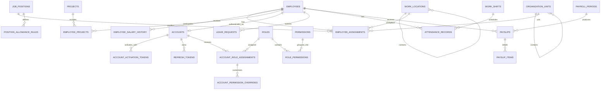

# Database Schema — Hệ thống quản lý nhân sự HRM

> Đây là bản thiết kế cơ sở dữ liệu dùng để duyệt nghiệp vụ, chưa phải Flyway migration.
>
> Hệ thống phục vụ một doanh nghiệp bán lẻ/phân phối có trụ sở, chi nhánh và kho. Kho được xem là địa điểm làm việc, không quản lý hàng hóa hoặc tồn kho.
>
> Phạm vi tính lương của đồ án gồm: lương cơ bản, phụ cấp chức vụ, phụ cấp thâm niên, phụ cấp dự án và tiền tăng ca. Bảo hiểm, thuế, thưởng và hoa hồng nằm ngoài phạm vi MVP.

---

## 1. Nguyên tắc thiết kế

- Database: PostgreSQL.
- Khóa chính dùng `BIGSERIAL`.
- Thời điểm dùng `TIMESTAMPTZ`, ngày nghiệp vụ dùng `DATE`.
- Tiền dùng `NUMERIC(15,2)`, phần trăm/hệ số dùng `NUMERIC(8,4)`, thời lượng dùng phút `INTEGER`.
- Hệ thống chỉ phục vụ một doanh nghiệp nên không lặp `company_id` trong các bảng nghiệp vụ.
- Bảng danh mục được xóa mềm bằng `deleted_at`; bảng giao dịch và lịch sử không xóa mà đổi trạng thái.
- Lương, CCCD và tài khoản ngân hàng là dữ liệu nhạy cảm, phải che hoặc mã hóa khi triển khai.
- Lương cơ bản và các chính sách phụ cấp phải có thời gian hiệu lực để tính lại đúng dữ liệu lịch sử.
- Phiếu lương đã duyệt là dữ liệu snapshot và không thay đổi khi chính sách hoặc thông tin nhân viên thay đổi sau này.

### 1.1. Xử lý nhân viên nghỉ việc

Nhân viên nghỉ việc không bị xóa khỏi hệ thống:

```text
Nhân viên nghỉ việc
  → employees.employment_status = RESIGNED hoặc TERMINATED
  → employees.termination_date được cập nhật
  → kết thúc employee_assignments hiện tại
  → kết thúc employee_projects đang tham gia
  → accounts.status = DISABLED
  → giữ nguyên chấm công và phiếu lương lịch sử
```

Chỉ hồ sơ được tạo nhầm mới dùng `employees.deleted_at`.

### 1.2. Danh sách 25 bảng

| Nhóm | Các bảng |
|---|---|
| Doanh nghiệp và cơ cấu | `company_profile`, `work_locations`, `organization_units`, `job_positions` |
| Nhân sự và lương thỏa thuận | `employees`, `employee_assignments`, `employee_salary_history` |
| Phụ cấp và dự án | `position_allowance_rules`, `seniority_allowance_rules`, `projects`, `employee_projects` |
| Tài khoản và RBAC | `accounts`, `account_activation_tokens`, `refresh_tokens`, `permissions`, `roles`, `role_permissions`, `account_role_assignments`, `account_permission_overrides` |
| Nghỉ phép | `leave_requests` |
| Chấm công | `work_shifts`, `attendance_records` |
| Tính lương | `payroll_periods`, `payslips`, `payslip_items` |

### 1.3. Sơ đồ quan hệ tổng quát



---

## 2. Doanh nghiệp và cơ cấu tổ chức

### `company_profile` — Thông tin doanh nghiệp

| Tên cột | Kiểu | Ràng buộc | Ý nghĩa |
|---|---|---|---|
| `id` | SMALLINT | PK, CHECK = 1 | Luôn bằng `1` |
| `code` | VARCHAR(30) | NOT NULL, UNIQUE | Mã doanh nghiệp |
| `name` | VARCHAR(200) | NOT NULL | Tên doanh nghiệp |
| `tax_code` | VARCHAR(30) | UNIQUE | Mã số thuế |
| `phone` | VARCHAR(20) | | Số điện thoại |
| `email` | VARCHAR(100) | | Email liên hệ |
| `address` | TEXT | | Địa chỉ đăng ký |
| `timezone` | VARCHAR(50) | NOT NULL, DEFAULT `Asia/Ho_Chi_Minh` | Múi giờ nghiệp vụ |
| `created_at` | TIMESTAMPTZ | NOT NULL | Thời điểm tạo |
| `updated_at` | TIMESTAMPTZ | NOT NULL | Thời điểm cập nhật |

### `work_locations` — Trụ sở, chi nhánh và kho

| Tên cột | Kiểu | Ràng buộc | Ý nghĩa |
|---|---|---|---|
| `id` | BIGSERIAL | PK | Khóa chính |
| `parent_location_id` | BIGINT | FK → work_locations | Trụ sở/chi nhánh cha của kho |
| `code` | VARCHAR(30) | NOT NULL | Mã địa điểm |
| `name` | VARCHAR(150) | NOT NULL | Tên địa điểm |
| `location_type` | VARCHAR(20) | NOT NULL | `HEAD_OFFICE` / `BRANCH` / `WAREHOUSE` |
| `address` | TEXT | NOT NULL | Địa chỉ làm việc |
| `phone` | VARCHAR(20) | | Số điện thoại |
| `is_active` | BOOLEAN | NOT NULL, DEFAULT true | Trạng thái hoạt động |
| `created_at` | TIMESTAMPTZ | NOT NULL | Thời điểm tạo |
| `updated_at` | TIMESTAMPTZ | NOT NULL | Thời điểm cập nhật |
| `deleted_at` | TIMESTAMPTZ | | Xóa mềm |

> `UNIQUE(code) WHERE deleted_at IS NULL`. `WAREHOUSE` phải có cha là `HEAD_OFFICE` hoặc `BRANCH`; hai loại còn lại không có cha.

### `organization_units` — Phòng ban và nhóm

| Tên cột | Kiểu | Ràng buộc | Ý nghĩa |
|---|---|---|---|
| `id` | BIGSERIAL | PK | Khóa chính |
| `parent_unit_id` | BIGINT | FK → organization_units | Đơn vị cha |
| `code` | VARCHAR(30) | NOT NULL | Mã đơn vị |
| `name` | VARCHAR(150) | NOT NULL | Tên phòng ban/nhóm |
| `unit_type` | VARCHAR(20) | NOT NULL | `BOARD` / `DEPARTMENT` / `TEAM` |
| `is_active` | BOOLEAN | NOT NULL, DEFAULT true | Trạng thái hoạt động |
| `created_at` | TIMESTAMPTZ | NOT NULL | Thời điểm tạo |
| `updated_at` | TIMESTAMPTZ | NOT NULL | Thời điểm cập nhật |
| `deleted_at` | TIMESTAMPTZ | | Xóa mềm |

> `UNIQUE(code) WHERE deleted_at IS NULL`. Phòng ban là cơ cấu quản trị, không đồng nhất với địa điểm làm việc.

### `job_positions` — Chức vụ/vị trí công việc

| Tên cột | Kiểu | Ràng buộc | Ý nghĩa |
|---|---|---|---|
| `id` | BIGSERIAL | PK | Khóa chính |
| `code` | VARCHAR(30) | NOT NULL | Mã chức vụ |
| `title` | VARCHAR(150) | NOT NULL | Nhân viên, trưởng nhóm, trưởng phòng, giám đốc... |
| `description` | TEXT | | Mô tả công việc |
| `is_managerial` | BOOLEAN | NOT NULL, DEFAULT false | Có phải chức vụ quản lý |
| `is_active` | BOOLEAN | NOT NULL, DEFAULT true | Còn sử dụng |
| `created_at` | TIMESTAMPTZ | NOT NULL | Thời điểm tạo |
| `updated_at` | TIMESTAMPTZ | NOT NULL | Thời điểm cập nhật |
| `deleted_at` | TIMESTAMPTZ | | Xóa mềm |

> `UNIQUE(code) WHERE deleted_at IS NULL`.

---

## 3. Hồ sơ, phân công và lương cơ bản

### `employees` — Hồ sơ nhân sự

| Tên cột | Kiểu | Ràng buộc | Ý nghĩa |
|---|---|---|---|
| `id` | BIGSERIAL | PK | Khóa chính |
| `employee_code` | VARCHAR(30) | NOT NULL, UNIQUE | Mã nhân viên, không tái sử dụng |
| `full_name` | VARCHAR(200) | NOT NULL | Họ tên |
| `date_of_birth` | DATE | | Ngày sinh |
| `gender` | VARCHAR(20) | | `MALE` / `FEMALE` / `OTHER` / `UNDISCLOSED` |
| `highest_education_level` | VARCHAR(20) | | Trình độ cao nhất |
| `major` | VARCHAR(200) | | Chuyên ngành |
| `institution` | VARCHAR(200) | | Cơ sở đào tạo |
| `graduation_year` | SMALLINT | | Năm tốt nghiệp |
| `national_id` | VARCHAR(30) | UNIQUE | CCCD/hộ chiếu |
| `personal_email` | VARCHAR(100) | | Email cá nhân |
| `work_email` | VARCHAR(100) | UNIQUE | Email công việc |
| `phone` | VARCHAR(20) | | Số điện thoại |
| `address` | TEXT | | Địa chỉ liên hệ |
| `tax_code` | VARCHAR(30) | | Mã số thuế cá nhân |
| `bank_name` | VARCHAR(150) | | Ngân hàng nhận lương |
| `bank_account_number` | VARCHAR(50) | | Số tài khoản |
| `bank_account_holder` | VARCHAR(200) | | Tên chủ tài khoản |
| `hire_date` | DATE | NOT NULL | Ngày vào làm |
| `seniority_start_date` | DATE | NOT NULL | Mốc bắt đầu tính thâm niên, mặc định bằng `hire_date` |
| `employment_status` | VARCHAR(20) | NOT NULL | `PROBATION` / `ACTIVE` / `RESIGNED` / `TERMINATED` / `RETIRED` |
| `termination_date` | DATE | | Ngày làm việc cuối cùng |
| `termination_reason` | TEXT | | Lý do kết thúc làm việc |
| `created_at` | TIMESTAMPTZ | NOT NULL | Thời điểm tạo |
| `updated_at` | TIMESTAMPTZ | NOT NULL | Thời điểm cập nhật |
| `deleted_at` | TIMESTAMPTZ | | Chỉ dùng với hồ sơ tạo nhầm |
| `deleted_by_account_id` | BIGINT | FK → accounts | Người xóa mềm |
| `deletion_reason` | TEXT | | Lý do xóa mềm |

> `seniority_start_date` cho phép HR điều chỉnh mốc tính thâm niên khi nhân viên nghỉ việc rồi quay lại hoặc được bảo lưu thời gian công tác.

### `employee_assignments` — Lịch sử phân công

| Tên cột | Kiểu | Ràng buộc | Ý nghĩa |
|---|---|---|---|
| `id` | BIGSERIAL | PK | Khóa chính |
| `employee_id` | BIGINT | FK → employees, NOT NULL | Nhân viên |
| `organization_unit_id` | BIGINT | FK → organization_units, NOT NULL | Phòng ban/nhóm |
| `work_location_id` | BIGINT | FK → work_locations, NOT NULL | Địa điểm làm việc |
| `position_id` | BIGINT | FK → job_positions, NOT NULL | Chức vụ/vị trí |
| `shift_id` | BIGINT | FK → work_shifts | Ca làm việc |
| `manager_employee_id` | BIGINT | FK → employees | Quản lý trực tiếp |
| `employment_type` | VARCHAR(20) | NOT NULL | `FULL_TIME` / `PART_TIME` / `TEMPORARY` |
| `effective_from` | DATE | NOT NULL | Ngày bắt đầu |
| `effective_to` | DATE | | Ngày kết thúc |
| `is_primary` | BOOLEAN | NOT NULL, DEFAULT true | Phân công chính |
| `reason` | TEXT | | Tuyển mới, điều chuyển, bổ nhiệm... |
| `created_by_account_id` | BIGINT | FK → accounts, NOT NULL | Người ghi nhận |
| `created_at` | TIMESTAMPTZ | NOT NULL | Thời điểm tạo |

> Khi đổi phòng ban, địa điểm, chức vụ hoặc ca làm, đóng bản ghi hiện tại bằng `effective_to` rồi tạo bản ghi mới. Một nhân viên chỉ có một phân công chính hiệu lực tại một thời điểm.

### `employee_salary_history` — Lịch sử lương cơ bản

| Tên cột | Kiểu | Ràng buộc | Ý nghĩa |
|---|---|---|---|
| `id` | BIGSERIAL | PK | Khóa chính |
| `employee_id` | BIGINT | FK → employees, NOT NULL | Nhân viên |
| `base_salary` | NUMERIC(15,2) | NOT NULL, CHECK > 0 | Lương cơ bản tháng đã thỏa thuận |
| `effective_from` | DATE | NOT NULL | Ngày bắt đầu áp dụng |
| `effective_to` | DATE | | Ngày kết thúc áp dụng |
| `approved_by_account_id` | BIGINT | FK → accounts, NOT NULL | Người duyệt |
| `reason` | VARCHAR(250) | | Tuyển mới, tăng lương, điều chỉnh... |
| `note` | TEXT | | Ghi chú |
| `created_at` | TIMESTAMPTZ | NOT NULL | Thời điểm tạo |

> Bảng này thay cho `employee_compensations`. Nó chỉ lưu lương cơ bản và lịch sử thay đổi lương, không chứa các khoản phụ cấp. Một nhân viên chỉ có một mức lương cơ bản hiệu lực tại một thời điểm.

---

## 4. Chính sách phụ cấp và dự án

### `position_allowance_rules` — Phụ cấp theo chức vụ

| Tên cột | Kiểu | Ràng buộc | Ý nghĩa |
|---|---|---|---|
| `id` | BIGSERIAL | PK | Khóa chính |
| `job_position_id` | BIGINT | FK → job_positions, NOT NULL | Chức vụ được hưởng |
| `monthly_amount` | NUMERIC(15,2) | NOT NULL, CHECK >= 0 | Mức phụ cấp mỗi tháng |
| `effective_from` | DATE | NOT NULL | Ngày bắt đầu áp dụng |
| `effective_to` | DATE | | Ngày kết thúc áp dụng |
| `approved_by_account_id` | BIGINT | FK → accounts, NOT NULL | Người duyệt |
| `note` | TEXT | | Ghi chú |
| `created_at` | TIMESTAMPTZ | NOT NULL | Thời điểm tạo |

Ví dụ dữ liệu:

| Chức vụ | Phụ cấp tháng |
|---|---:|
| Nhân viên | 0 |
| Trưởng nhóm | 500.000 |
| Trưởng phòng | 1.500.000 |
| Giám đốc | 5.000.000 |

> Mỗi chức vụ chỉ có một quy tắc phụ cấp hiệu lực tại một thời điểm. Chức vụ của nhân viên được xác định từ `employee_assignments`.

### `seniority_allowance_rules` — Phụ cấp theo thâm niên

| Tên cột | Kiểu | Ràng buộc | Ý nghĩa |
|---|---|---|---|
| `id` | BIGSERIAL | PK | Khóa chính |
| `min_years` | INTEGER | NOT NULL, CHECK >= 0 | Số năm tối thiểu |
| `max_years` | INTEGER | | Số năm tối đa; null nghĩa là không giới hạn |
| `percentage` | NUMERIC(8,4) | NOT NULL, CHECK >= 0 | Tỷ lệ trên lương cơ bản, ví dụ `5.0000` = 5% |
| `effective_from` | DATE | NOT NULL | Ngày bắt đầu áp dụng chính sách |
| `effective_to` | DATE | | Ngày kết thúc áp dụng |
| `approved_by_account_id` | BIGINT | FK → accounts, NOT NULL | Người duyệt |
| `note` | TEXT | | Ghi chú |
| `created_at` | TIMESTAMPTZ | NOT NULL | Thời điểm tạo |

Ví dụ dữ liệu:

| Từ năm | Đến dưới năm | Tỷ lệ |
|---:|---:|---:|
| 0 | 2 | 0% |
| 2 | 5 | 5% |
| 5 | 10 | 10% |
| 10 | Không giới hạn | 15% |

> Số năm thâm niên được tính tại ngày cuối kỳ lương từ `employees.seniority_start_date`. Các khoảng năm đang hiệu lực không được chồng lấn.

### `projects` — Dự án

| Tên cột | Kiểu | Ràng buộc | Ý nghĩa |
|---|---|---|---|
| `id` | BIGSERIAL | PK | Khóa chính |
| `code` | VARCHAR(30) | NOT NULL | Mã dự án |
| `name` | VARCHAR(200) | NOT NULL | Tên dự án |
| `description` | TEXT | | Mô tả |
| `start_date` | DATE | NOT NULL | Ngày bắt đầu |
| `end_date` | DATE | | Ngày kết thúc dự kiến/thực tế |
| `status` | VARCHAR(20) | NOT NULL | `PLANNED` / `ACTIVE` / `COMPLETED` / `CANCELLED` |
| `manager_employee_id` | BIGINT | FK → employees | Người quản lý dự án |
| `created_by_account_id` | BIGINT | FK → accounts, NOT NULL | Người tạo |
| `created_at` | TIMESTAMPTZ | NOT NULL | Thời điểm tạo |
| `updated_at` | TIMESTAMPTZ | NOT NULL | Thời điểm cập nhật |
| `deleted_at` | TIMESTAMPTZ | | Xóa mềm khi tạo nhầm và chưa phát sinh phân công |

> `UNIQUE(code) WHERE deleted_at IS NULL`.

### `employee_projects` — Nhân viên tham gia dự án

| Tên cột | Kiểu | Ràng buộc | Ý nghĩa |
|---|---|---|---|
| `id` | BIGSERIAL | PK | Khóa chính |
| `employee_id` | BIGINT | FK → employees, NOT NULL | Nhân viên tham gia |
| `project_id` | BIGINT | FK → projects, NOT NULL | Dự án |
| `project_role` | VARCHAR(100) | NOT NULL | Vai trò trong dự án |
| `start_date` | DATE | NOT NULL | Ngày bắt đầu tham gia |
| `end_date` | DATE | | Ngày kết thúc tham gia |
| `monthly_allowance_amount` | NUMERIC(15,2) | NOT NULL, DEFAULT 0, CHECK >= 0 | Phụ cấp dự án của nhân viên mỗi tháng |
| `status` | VARCHAR(20) | NOT NULL | `PLANNED` / `ACTIVE` / `COMPLETED` / `CANCELLED` |
| `approved_by_account_id` | BIGINT | FK → accounts, NOT NULL | Người duyệt phân công và phụ cấp |
| `note` | TEXT | | Ghi chú |
| `created_at` | TIMESTAMPTZ | NOT NULL | Thời điểm tạo |
| `updated_at` | TIMESTAMPTZ | NOT NULL | Thời điểm cập nhật |

> Đây là bảng trung gian cho quan hệ nhiều–nhiều: một dự án có nhiều nhân viên và một nhân viên có thể tham gia nhiều dự án. Phụ cấp đặt tại bảng này vì mỗi người có thể nhận mức khác nhau trong cùng dự án. Không được có hai lần tham gia cùng một dự án bị chồng khoảng thời gian.

---

## 5. Tài khoản và phân quyền RBAC

### `accounts` — Tài khoản đăng nhập

| Tên cột | Kiểu | Ràng buộc | Ý nghĩa |
|---|---|---|---|
| `id` | BIGSERIAL | PK | Khóa chính |
| `employee_id` | BIGINT | FK → employees, UNIQUE | Hồ sơ liên kết; null chỉ dành cho bootstrap admin |
| `username` | VARCHAR(50) | NOT NULL, UNIQUE | Tên đăng nhập |
| `email` | VARCHAR(100) | NOT NULL, UNIQUE | Email đăng nhập |
| `password_hash` | VARCHAR(255) | nullable khi `PENDING` | Mật khẩu đã hash |
| `status` | VARCHAR(20) | NOT NULL | `PENDING` / `ACTIVE` / `LOCKED` / `DISABLED` |
| `failed_login_count` | INTEGER | NOT NULL, DEFAULT 0 | Số lần đăng nhập sai liên tiếp |
| `locked_until` | TIMESTAMPTZ | | Khóa tạm đến thời điểm |
| `last_login_at` | TIMESTAMPTZ | | Lần đăng nhập gần nhất |
| `created_at` | TIMESTAMPTZ | NOT NULL | Thời điểm tạo |
| `updated_at` | TIMESTAMPTZ | NOT NULL | Thời điểm cập nhật |

### `account_activation_tokens` — Token kích hoạt tài khoản

| Tên cột | Kiểu | Ràng buộc | Ý nghĩa |
|---|---|---|---|
| `id` | BIGSERIAL | PK | Khóa chính |
| `account_id` | BIGINT | FK → accounts, NOT NULL | Tài khoản chờ kích hoạt |
| `token_hash` | CHAR(64) | NOT NULL, UNIQUE | SHA-256 hash của token |
| `expires_at` | TIMESTAMPTZ | NOT NULL | Thời điểm hết hạn |
| `used_at` | TIMESTAMPTZ | | Thời điểm sử dụng |
| `revoked_at` | TIMESTAMPTZ | | Thời điểm thu hồi |
| `created_by_account_id` | BIGINT | FK → accounts, NOT NULL | Người phát hành |
| `created_at` | TIMESTAMPTZ | NOT NULL | Thời điểm tạo |

### `refresh_tokens` — Phiên đăng nhập có thể làm mới

| Tên cột | Kiểu | Ràng buộc | Ý nghĩa |
|---|---|---|---|
| `id` | BIGSERIAL | PK | Khóa chính |
| `token_hash` | CHAR(64) | NOT NULL, UNIQUE | SHA-256 hash của refresh token |
| `account_id` | BIGINT | FK → accounts, NOT NULL | Chủ phiên |
| `expires_at` | TIMESTAMPTZ | NOT NULL | Thời điểm hết hạn |
| `revoked_at` | TIMESTAMPTZ | | Thời điểm thu hồi/rotate |
| `created_at` | TIMESTAMPTZ | NOT NULL | Thời điểm tạo |

### `permissions` — Danh mục quyền nguyên tử

| Tên cột | Kiểu | Ràng buộc | Ý nghĩa |
|---|---|---|---|
| `id` | BIGSERIAL | PK | Khóa chính |
| `code` | VARCHAR(100) | NOT NULL, UNIQUE | Mã quyền |
| `name` | VARCHAR(150) | NOT NULL | Tên hiển thị |
| `module` | VARCHAR(30) | NOT NULL | Phân hệ |
| `description` | TEXT | NOT NULL | Mô tả quyền |
| `assignment_policy` | VARCHAR(20) | NOT NULL | `DELEGABLE` / `SYSTEM_ONLY` |
| `is_active` | BOOLEAN | NOT NULL, DEFAULT true | Trạng thái |
| `created_at` | TIMESTAMPTZ | NOT NULL | Thời điểm tạo |

### `roles` — Mẫu vai trò

| Tên cột | Kiểu | Ràng buộc | Ý nghĩa |
|---|---|---|---|
| `id` | BIGSERIAL | PK | Khóa chính |
| `code` | VARCHAR(50) | NOT NULL, UNIQUE | Mã vai trò |
| `name` | VARCHAR(150) | NOT NULL | Tên hiển thị |
| `description` | TEXT | | Mô tả |
| `is_system` | BOOLEAN | NOT NULL, DEFAULT false | Vai trò hệ thống |
| `is_active` | BOOLEAN | NOT NULL, DEFAULT true | Trạng thái |
| `created_at` | TIMESTAMPTZ | NOT NULL | Thời điểm tạo |
| `updated_at` | TIMESTAMPTZ | NOT NULL | Thời điểm cập nhật |
| `deleted_at` | TIMESTAMPTZ | | Xóa mềm với vai trò tùy chỉnh |

### `role_permissions` — Quyền mặc định của vai trò

| Tên cột | Kiểu | Ràng buộc | Ý nghĩa |
|---|---|---|---|
| `role_id` | BIGINT | PK, FK → roles | Vai trò |
| `permission_id` | BIGINT | PK, FK → permissions | Quyền được cấp |
| `created_by_account_id` | BIGINT | FK → accounts | Người cấu hình; null với seed |
| `created_at` | TIMESTAMPTZ | NOT NULL | Thời điểm cấp |

### `account_role_assignments` — Gán vai trò và phạm vi

| Tên cột | Kiểu | Ràng buộc | Ý nghĩa |
|---|---|---|---|
| `id` | BIGSERIAL | PK | Khóa chính |
| `account_id` | BIGINT | FK → accounts, NOT NULL | Tài khoản |
| `role_id` | BIGINT | FK → roles, NOT NULL | Vai trò |
| `scope_type` | VARCHAR(20) | NOT NULL | `SELF` / `COMPANY` / `ORG_UNIT` / `LOCATION` |
| `organization_unit_id` | BIGINT | FK → organization_units | Phạm vi phòng ban |
| `work_location_id` | BIGINT | FK → work_locations | Phạm vi địa điểm |
| `effective_from` | DATE | NOT NULL | Ngày bắt đầu |
| `effective_to` | DATE | | Ngày kết thúc |
| `granted_by_account_id` | BIGINT | FK → accounts, NOT NULL | Người cấp |
| `reason` | TEXT | | Lý do |
| `created_at` | TIMESTAMPTZ | NOT NULL | Thời điểm tạo |
| `revoked_by_account_id` | BIGINT | FK → accounts | Người thu hồi |
| `revoked_at` | TIMESTAMPTZ | | Thời điểm thu hồi |
| `revocation_reason` | TEXT | | Lý do thu hồi |

### `account_permission_overrides` — Ngoại lệ quyền

| Tên cột | Kiểu | Ràng buộc | Ý nghĩa |
|---|---|---|---|
| `id` | BIGSERIAL | PK | Khóa chính |
| `account_role_assignment_id` | BIGINT | FK → account_role_assignments, NOT NULL | Lần gán vai trò |
| `permission_id` | BIGINT | FK → permissions, NOT NULL | Quyền ghi đè |
| `effect` | VARCHAR(10) | NOT NULL | `GRANT` / `REVOKE` |
| `effective_from` | DATE | NOT NULL | Ngày bắt đầu |
| `effective_to` | DATE | | Ngày kết thúc |
| `reason` | TEXT | NOT NULL | Lý do |
| `granted_by_account_id` | BIGINT | FK → accounts, NOT NULL | Người thiết lập |
| `created_at` | TIMESTAMPTZ | NOT NULL | Thời điểm tạo |

### 5.1. Permission code tối thiểu

```text
profile.self.read                 profile.self.update
employee.read                     employee.manage
employee.sensitive.read           employee.sensitive.manage
employee.lifecycle.approve        organization.manage

leave.self.read                   leave.self.create
leave.self.cancel                 leave.read
leave.approve                     leave.manage

attendance.self.read              attendance.read
attendance.manage                 attendance.overtime.approve

salary.read                       salary.manage
allowance.read                    allowance.manage
project.read                      project.manage

payroll.self.read                 payroll.self.print
payroll.calculate                 payroll.approve
payroll.mark_paid                 payroll.lock

report.hr.read                    report.payroll.read
rbac.manage
```

---

## 6. Nghỉ phép

### `leave_requests` — Đơn nghỉ của nhân viên

| Tên cột | Kiểu | Ràng buộc | Ý nghĩa |
|---|---|---|---|
| `id` | BIGSERIAL | PK | Khóa chính |
| `employee_id` | BIGINT | FK → employees, NOT NULL | Người gửi đơn |
| `leave_type` | VARCHAR(30) | NOT NULL | `ANNUAL` / `SICK` / `MATERNITY` / `UNPAID` / `OTHER` |
| `salary_treatment` | VARCHAR(30) | NOT NULL | `EMPLOYER_PAID` / `SOCIAL_INSURANCE` / `UNPAID` |
| `start_at` | TIMESTAMPTZ | NOT NULL | Thời điểm bắt đầu nghỉ |
| `end_at` | TIMESTAMPTZ | NOT NULL | Thời điểm kết thúc nghỉ |
| `requested_minutes` | INTEGER | NOT NULL, CHECK > 0 | Tổng phút nghỉ theo lịch làm việc |
| `reason` | TEXT | NOT NULL | Lý do |
| `attachment_url` | TEXT | | Minh chứng nếu có |
| `status` | VARCHAR(20) | NOT NULL | `DRAFT` / `PENDING` / `APPROVED` / `REJECTED` / `CANCELLED` |
| `submitted_at` | TIMESTAMPTZ | | Thời điểm nộp |
| `reviewed_by_account_id` | BIGINT | FK → accounts | Người duyệt |
| `review_comment` | TEXT | | Nhận xét duyệt/từ chối |
| `reviewed_at` | TIMESTAMPTZ | | Thời điểm duyệt |
| `created_at` | TIMESTAMPTZ | NOT NULL | Thời điểm tạo |
| `updated_at` | TIMESTAMPTZ | NOT NULL | Thời điểm cập nhật |

> Bảng này thay `employee_requests` chung chung. Nghỉ việc được HR cập nhật trực tiếp vào vòng đời nhân viên; bảng này chỉ quản lý nghỉ phép.
>
> Quy tắc mặc định:
>
> - `ANNUAL` → `EMPLOYER_PAID`: vẫn tính vào phút hưởng lương.
> - `UNPAID` → `UNPAID`: không tính vào phút hưởng lương.
> - `MATERNITY` → `SOCIAL_INSURANCE`: không tính lương doanh nghiệp theo phút; chế độ BHXH nằm ngoài bảng lương MVP.
> - Nghỉ không phép không tạo `leave_requests` được duyệt; ngày công được đánh dấu `UNAUTHORIZED_ABSENCE`.

---

## 7. Ca làm việc, chấm công và tăng ca

### `work_shifts` — Danh mục ca làm việc

| Tên cột | Kiểu | Ràng buộc | Ý nghĩa |
|---|---|---|---|
| `id` | BIGSERIAL | PK | Khóa chính |
| `code` | VARCHAR(30) | NOT NULL | Mã ca |
| `name` | VARCHAR(100) | NOT NULL | Tên ca |
| `start_time` | TIME | NOT NULL | Giờ bắt đầu |
| `end_time` | TIME | NOT NULL | Giờ kết thúc |
| `break_minutes` | INTEGER | NOT NULL, DEFAULT 0, CHECK >= 0 | Phút nghỉ giữa ca |
| `standard_work_minutes` | INTEGER | NOT NULL, CHECK > 0 | Phút công chuẩn |
| `grace_late_minutes` | INTEGER | NOT NULL, DEFAULT 0, CHECK >= 0 | Khoảng trễ cho phép |
| `crosses_midnight` | BOOLEAN | NOT NULL, DEFAULT false | Ca qua ngày |
| `is_active` | BOOLEAN | NOT NULL, DEFAULT true | Trạng thái |
| `created_at` | TIMESTAMPTZ | NOT NULL | Thời điểm tạo |
| `updated_at` | TIMESTAMPTZ | NOT NULL | Thời điểm cập nhật |
| `deleted_at` | TIMESTAMPTZ | | Xóa mềm |

### `attendance_records` — Chấm công hằng ngày

| Tên cột | Kiểu | Ràng buộc | Ý nghĩa |
|---|---|---|---|
| `id` | BIGSERIAL | PK | Khóa chính |
| `employee_id` | BIGINT | FK → employees, NOT NULL | Nhân viên |
| `work_date` | DATE | NOT NULL | Ngày công |
| `shift_id` | BIGINT | FK → work_shifts, NOT NULL | Ca áp dụng |
| `leave_request_id` | BIGINT | FK → leave_requests | Đơn nghỉ đã duyệt liên quan |
| `scheduled_start_at` | TIMESTAMPTZ | NOT NULL | Giờ vào dự kiến snapshot |
| `scheduled_end_at` | TIMESTAMPTZ | NOT NULL | Giờ ra dự kiến snapshot |
| `scheduled_minutes` | INTEGER | NOT NULL, CHECK > 0 | Phút công chuẩn snapshot |
| `check_in_at` | TIMESTAMPTZ | | Giờ vào thực tế |
| `check_out_at` | TIMESTAMPTZ | | Giờ ra thực tế |
| `worked_minutes` | INTEGER | NOT NULL, DEFAULT 0, CHECK >= 0 | Phút làm thực tế |
| `payable_minutes` | INTEGER | NOT NULL, DEFAULT 0, CHECK >= 0 | Phút được tính lương cơ bản |
| `late_minutes` | INTEGER | NOT NULL, DEFAULT 0, CHECK >= 0 | Phút đi trễ |
| `early_leave_minutes` | INTEGER | NOT NULL, DEFAULT 0, CHECK >= 0 | Phút về sớm |
| `overtime_minutes` | INTEGER | NOT NULL, DEFAULT 0, CHECK >= 0 | Phút tăng ca được duyệt |
| `overtime_multiplier` | NUMERIC(8,4) | NOT NULL, DEFAULT 1, CHECK > 0 | Hệ số tăng ca |
| `overtime_approved_by_account_id` | BIGINT | FK → accounts | Người duyệt tăng ca |
| `overtime_approved_at` | TIMESTAMPTZ | | Thời điểm duyệt tăng ca |
| `status` | VARCHAR(30) | NOT NULL | Trạng thái ngày công |
| `note` | TEXT | | Lý do điều chỉnh |
| `updated_by_account_id` | BIGINT | FK → accounts | Người sửa cuối |
| `created_at` | TIMESTAMPTZ | NOT NULL | Thời điểm tạo |
| `updated_at` | TIMESTAMPTZ | NOT NULL | Thời điểm cập nhật |

Giá trị `status`:

```text
PRESENT
PAID_LEAVE
UNPAID_LEAVE
MATERNITY_LEAVE
SICK_LEAVE
UNAUTHORIZED_ABSENCE
HOLIDAY
MISSING_PUNCH
```

> `UNIQUE(employee_id, work_date)`. Đi muộn và về sớm làm giảm `payable_minutes` theo nội quy, không phải là khoản phạt. Về muộn chỉ được tính tăng ca khi số phút và hệ số đã được duyệt.

---

## 8. Tính lương

### 8.1. Nguồn dữ liệu tính lương

| Thành phần | Nguồn |
|---|---|
| Lương cơ bản | `employee_salary_history` |
| Chức vụ hiện tại | `employee_assignments` |
| Phụ cấp chức vụ | `position_allowance_rules` |
| Số năm thâm niên | `employees.seniority_start_date` |
| Tỷ lệ phụ cấp thâm niên | `seniority_allowance_rules` |
| Dự án và phụ cấp dự án | `employee_projects` |
| Phút công, nghỉ và tăng ca | `attendance_records` |

### 8.2. Công thức

```text
Đơn giá phút
  = Lương cơ bản tháng / Tổng phút công chuẩn của kỳ

Lương cơ bản thực nhận
  = Lương cơ bản tháng × Phút được hưởng lương / Tổng phút công chuẩn

Phụ cấp chức vụ
  = Mức phụ cấp chức vụ hiệu lực trong kỳ

Phụ cấp thâm niên
  = Lương cơ bản tháng × Tỷ lệ thâm niên / 100

Phụ cấp dự án
  = Tổng phụ cấp của các employee_projects hiệu lực trong kỳ

Tiền tăng ca
  = Σ (Phút tăng ca được duyệt × Đơn giá phút × Hệ số tăng ca)

Tổng thu nhập
  = Lương cơ bản thực nhận
  + Phụ cấp chức vụ
  + Phụ cấp thâm niên
  + Phụ cấp dự án
  + Tiền tăng ca
```

Quy tắc:

- `PAID_LEAVE` và `HOLIDAY` được tính vào `payable_minutes`.
- `UNPAID_LEAVE`, `UNAUTHORIZED_ABSENCE` và `MATERNITY_LEAVE` không tính vào `payable_minutes` của doanh nghiệp.
- Thai sản không bị xem là nghỉ không phép; khoản BHXH thai sản nằm ngoài payroll MVP.
- Nếu nhân viên tham gia hoặc rời dự án giữa tháng, phụ cấp dự án được phân bổ theo số ngày tham gia trong kỳ.
- Phụ cấp chức vụ và thâm niên được lấy theo chính sách có hiệu lực tại kỳ lương; thay đổi giữa kỳ được phân bổ theo thời gian hiệu lực.
- Trước khi duyệt có thể tính lại phiếu nháp; từ `APPROVED` trở đi dữ liệu bất biến.

### `payroll_periods` — Kỳ lương tháng

| Tên cột | Kiểu | Ràng buộc | Ý nghĩa |
|---|---|---|---|
| `id` | BIGSERIAL | PK | Khóa chính |
| `year` | SMALLINT | NOT NULL | Năm lương |
| `month` | SMALLINT | NOT NULL, CHECK 1..12 | Tháng lương |
| `period_start` | DATE | NOT NULL | Ngày đầu kỳ |
| `period_end` | DATE | NOT NULL | Ngày cuối kỳ |
| `status` | VARCHAR(20) | NOT NULL | Trạng thái vòng đời |
| `calculated_by_account_id` | BIGINT | FK → accounts | Người tính |
| `calculated_at` | TIMESTAMPTZ | | Thời điểm tính |
| `approved_by_account_id` | BIGINT | FK → accounts | Người duyệt |
| `approved_at` | TIMESTAMPTZ | | Thời điểm duyệt |
| `paid_by_account_id` | BIGINT | FK → accounts | Người xác nhận trả |
| `paid_at` | TIMESTAMPTZ | | Thời điểm xác nhận trả |
| `locked_by_account_id` | BIGINT | FK → accounts | Người khóa |
| `locked_at` | TIMESTAMPTZ | | Thời điểm khóa |
| `created_at` | TIMESTAMPTZ | NOT NULL | Thời điểm tạo |
| `updated_at` | TIMESTAMPTZ | NOT NULL | Thời điểm cập nhật |

> `UNIQUE(year, month)`. Vòng đời: `DRAFT` → `CALCULATED` → `APPROVED` → `PAID` → `LOCKED`. Có thể `CANCELLED` trước khi duyệt.

### `payslips` — Phiếu lương nhân viên

| Tên cột | Kiểu | Ràng buộc | Ý nghĩa |
|---|---|---|---|
| `id` | BIGSERIAL | PK | Khóa chính |
| `payroll_period_id` | BIGINT | FK → payroll_periods, NOT NULL | Kỳ lương |
| `employee_id` | BIGINT | FK → employees, NOT NULL | Nhân viên |
| `employee_code_snapshot` | VARCHAR(30) | NOT NULL | Mã nhân viên lúc tính |
| `employee_name_snapshot` | VARCHAR(200) | NOT NULL | Tên nhân viên lúc tính |
| `position_snapshot` | VARCHAR(150) | NOT NULL | Chức vụ lúc tính |
| `work_location_snapshot` | VARCHAR(150) | NOT NULL | Địa điểm lúc tính |
| `organization_unit_snapshot` | VARCHAR(150) | NOT NULL | Phòng ban lúc tính |
| `contractual_base_salary` | NUMERIC(15,2) | NOT NULL, CHECK >= 0 | Lương cơ bản tháng snapshot |
| `scheduled_work_minutes` | INTEGER | NOT NULL, CHECK > 0 | Tổng phút công chuẩn |
| `payable_work_minutes` | INTEGER | NOT NULL, CHECK >= 0 | Tổng phút hưởng lương |
| `approved_overtime_minutes` | INTEGER | NOT NULL, DEFAULT 0, CHECK >= 0 | Phút tăng ca được duyệt |
| `base_salary_pay` | NUMERIC(15,2) | NOT NULL, CHECK >= 0 | Lương cơ bản thực nhận |
| `position_allowance_pay` | NUMERIC(15,2) | NOT NULL, DEFAULT 0, CHECK >= 0 | Phụ cấp chức vụ |
| `seniority_allowance_pay` | NUMERIC(15,2) | NOT NULL, DEFAULT 0, CHECK >= 0 | Phụ cấp thâm niên |
| `project_allowance_pay` | NUMERIC(15,2) | NOT NULL, DEFAULT 0, CHECK >= 0 | Tổng phụ cấp dự án |
| `allowance_pay` | NUMERIC(15,2) | NOT NULL, DEFAULT 0, CHECK >= 0 | Tổng ba loại phụ cấp |
| `overtime_pay` | NUMERIC(15,2) | NOT NULL, DEFAULT 0, CHECK >= 0 | Tiền tăng ca |
| `gross_pay` | NUMERIC(15,2) | NOT NULL, CHECK >= 0 | Tổng thu nhập |
| `net_pay` | NUMERIC(15,2) | NOT NULL, CHECK >= 0 | Thực nhận; trong MVP bằng gross |
| `created_at` | TIMESTAMPTZ | NOT NULL | Thời điểm tạo |
| `updated_at` | TIMESTAMPTZ | NOT NULL | Chỉ cập nhật khi kỳ chưa duyệt |

> `UNIQUE(payroll_period_id, employee_id)`.

### `payslip_items` — Chi tiết khoản lương snapshot

| Tên cột | Kiểu | Ràng buộc | Ý nghĩa |
|---|---|---|---|
| `id` | BIGSERIAL | PK | Khóa chính |
| `payslip_id` | BIGINT | FK → payslips, NOT NULL | Phiếu lương |
| `component_type` | VARCHAR(30) | NOT NULL | Loại thành phần |
| `component_code` | VARCHAR(50) | NOT NULL | Mã thành phần |
| `description` | VARCHAR(250) | NOT NULL | Mô tả snapshot |
| `quantity` | NUMERIC(12,4) | NOT NULL, DEFAULT 1 | Phút, tỷ lệ hoặc số lượng |
| `unit_rate` | NUMERIC(15,4) | NOT NULL, CHECK >= 0 | Đơn giá snapshot |
| `multiplier` | NUMERIC(8,4) | NOT NULL, DEFAULT 1, CHECK > 0 | Hệ số snapshot |
| `amount` | NUMERIC(15,2) | NOT NULL, CHECK >= 0 | Thành tiền |
| `created_at` | TIMESTAMPTZ | NOT NULL | Thời điểm tạo |

Giá trị `component_type`:

```text
BASE_SALARY
POSITION_ALLOWANCE
SENIORITY_ALLOWANCE
PROJECT_ALLOWANCE
OVERTIME
```

> Với phụ cấp dự án, mỗi dự án tạo một dòng `PROJECT_ALLOWANCE` riêng để giải thích tổng tiền. `payslip_items` không giữ khóa ngoại về dữ liệu nguồn vì đây là snapshot lịch sử.

---

## 9. Ví dụ tính lương

Nhân viên A có:

- Lương cơ bản: 10.000.000 đồng.
- Chức vụ trưởng phòng: 1.500.000 đồng/tháng.
- Thâm niên 3 năm: 5% lương cơ bản = 500.000 đồng.
- Dự án HRM: 1.000.000 đồng/tháng.
- Dự án Mobile: 500.000 đồng/tháng.
- Không có thời gian nghỉ không lương và chưa tính tăng ca.

```text
Tổng thu nhập
  = 10.000.000
  + 1.500.000
  +   500.000
  + 1.000.000
  +   500.000
  = 13.500.000 đồng
```

Nếu tháng có 26 ngày × 8 giờ = 12.480 phút công chuẩn và nhân viên nghỉ không phép 480 phút:

```text
Lương cơ bản thực nhận
  = 10.000.000 × (12.480 - 480) / 12.480
  = 9.615.385 đồng (làm tròn)
```

Nghỉ phép năm có lương 480 phút vẫn được cộng vào `payable_minutes`, nên không làm giảm lương cơ bản.

---

## 10. Báo cáo đáp ứng đề bài

| Báo cáo | Nguồn dữ liệu |
|---|---|
| Nhân sự đang làm/đã nghỉ việc | `employees` |
| Nhân sự đang nghỉ phép/thai sản | `leave_requests`, `attendance_records` |
| Nhân sự theo địa điểm | `employee_assignments`, `work_locations` |
| Nhân sự theo phòng ban/chức vụ | `employee_assignments`, `organization_units`, `job_positions` |
| Trình độ nhân sự | `employees.highest_education_level` |
| Thâm niên | `employees.seniority_start_date` |
| Lịch sử lương cơ bản | `employee_salary_history` |
| Danh sách phụ cấp theo chức vụ | `position_allowance_rules`, `job_positions` |
| Nhân viên theo dự án | `projects`, `employee_projects`, `employees` |
| Chấm công, đi trễ, về sớm, vắng mặt | `attendance_records` |
| Tổng lương theo tháng/đơn vị/địa điểm | `payroll_periods`, `payslips` |
| Chi tiết thành phần lương | `payslips`, `payslip_items` |
| Lịch sử phân quyền | `account_role_assignments`, `account_permission_overrides` |

---

## 11. Indexes quan trọng

```sql
CREATE INDEX idx_locations_parent
  ON work_locations (parent_location_id) WHERE deleted_at IS NULL;

CREATE INDEX idx_units_parent
  ON organization_units (parent_unit_id) WHERE deleted_at IS NULL;

CREATE INDEX idx_employees_status
  ON employees (employment_status) WHERE deleted_at IS NULL;

CREATE INDEX idx_assignments_employee_period
  ON employee_assignments (employee_id, effective_from, effective_to);

CREATE INDEX idx_assignments_position_period
  ON employee_assignments (position_id, effective_from, effective_to);

CREATE INDEX idx_salary_history_employee_period
  ON employee_salary_history (employee_id, effective_from, effective_to);

CREATE INDEX idx_position_allowance_period
  ON position_allowance_rules (job_position_id, effective_from, effective_to);

CREATE INDEX idx_seniority_rules_period
  ON seniority_allowance_rules (effective_from, effective_to, min_years, max_years);

CREATE INDEX idx_projects_status
  ON projects (status) WHERE deleted_at IS NULL;

CREATE INDEX idx_employee_projects_employee_period
  ON employee_projects (employee_id, start_date, end_date);

CREATE INDEX idx_employee_projects_project_status
  ON employee_projects (project_id, status);

CREATE INDEX idx_role_assignments_account_period
  ON account_role_assignments (account_id, effective_from, effective_to);

CREATE INDEX idx_permission_overrides_assignment
  ON account_permission_overrides (account_role_assignment_id, effective_from, effective_to);

CREATE INDEX idx_leave_requests_employee_status
  ON leave_requests (employee_id, status, start_at);

CREATE INDEX idx_attendance_employee_date
  ON attendance_records (employee_id, work_date DESC);

CREATE INDEX idx_payslips_employee_period
  ON payslips (employee_id, payroll_period_id);

CREATE INDEX idx_payslip_items_payslip
  ON payslip_items (payslip_id);
```

---

## 12. Constraints và quy tắc nghiệp vụ

### 12.1. CHECK constraints chính

```sql
ALTER TABLE company_profile ADD CONSTRAINT chk_single_company
  CHECK (id = 1);

ALTER TABLE work_locations ADD CONSTRAINT chk_location_type
  CHECK (location_type IN ('HEAD_OFFICE', 'BRANCH', 'WAREHOUSE'));

ALTER TABLE employees ADD CONSTRAINT chk_employee_status
  CHECK (employment_status IN ('PROBATION', 'ACTIVE', 'RESIGNED', 'TERMINATED', 'RETIRED'));

ALTER TABLE employees ADD CONSTRAINT chk_employee_dates
  CHECK (
    seniority_start_date >= hire_date
    AND (termination_date IS NULL OR termination_date >= hire_date)
  );

ALTER TABLE employee_salary_history ADD CONSTRAINT chk_salary_period
  CHECK (effective_to IS NULL OR effective_to >= effective_from);

ALTER TABLE position_allowance_rules ADD CONSTRAINT chk_position_allowance_period
  CHECK (effective_to IS NULL OR effective_to >= effective_from);

ALTER TABLE seniority_allowance_rules ADD CONSTRAINT chk_seniority_range
  CHECK (
    min_years >= 0
    AND (max_years IS NULL OR max_years > min_years)
    AND percentage >= 0
  );

ALTER TABLE projects ADD CONSTRAINT chk_project_status
  CHECK (status IN ('PLANNED', 'ACTIVE', 'COMPLETED', 'CANCELLED'));

ALTER TABLE projects ADD CONSTRAINT chk_project_period
  CHECK (end_date IS NULL OR end_date >= start_date);

ALTER TABLE employee_projects ADD CONSTRAINT chk_employee_project_status
  CHECK (status IN ('PLANNED', 'ACTIVE', 'COMPLETED', 'CANCELLED'));

ALTER TABLE employee_projects ADD CONSTRAINT chk_employee_project_period
  CHECK (end_date IS NULL OR end_date >= start_date);

ALTER TABLE leave_requests ADD CONSTRAINT chk_leave_type
  CHECK (leave_type IN ('ANNUAL', 'SICK', 'MATERNITY', 'UNPAID', 'OTHER'));

ALTER TABLE leave_requests ADD CONSTRAINT chk_leave_salary_treatment
  CHECK (salary_treatment IN ('EMPLOYER_PAID', 'SOCIAL_INSURANCE', 'UNPAID'));

ALTER TABLE leave_requests ADD CONSTRAINT chk_leave_status
  CHECK (status IN ('DRAFT', 'PENDING', 'APPROVED', 'REJECTED', 'CANCELLED'));

ALTER TABLE leave_requests ADD CONSTRAINT chk_leave_period
  CHECK (end_at > start_at AND requested_minutes > 0);

ALTER TABLE accounts ADD CONSTRAINT chk_account_status
  CHECK (status IN ('PENDING', 'ACTIVE', 'LOCKED', 'DISABLED'));

ALTER TABLE account_role_assignments ADD CONSTRAINT chk_role_scope
  CHECK (
    (scope_type IN ('SELF', 'COMPANY') AND organization_unit_id IS NULL AND work_location_id IS NULL)
    OR (scope_type = 'ORG_UNIT' AND organization_unit_id IS NOT NULL AND work_location_id IS NULL)
    OR (scope_type = 'LOCATION' AND organization_unit_id IS NULL AND work_location_id IS NOT NULL)
  );

ALTER TABLE account_permission_overrides ADD CONSTRAINT chk_override_effect
  CHECK (effect IN ('GRANT', 'REVOKE'));

ALTER TABLE attendance_records ADD CONSTRAINT chk_attendance_status
  CHECK (status IN (
    'PRESENT', 'PAID_LEAVE', 'UNPAID_LEAVE', 'MATERNITY_LEAVE',
    'SICK_LEAVE', 'UNAUTHORIZED_ABSENCE', 'HOLIDAY', 'MISSING_PUNCH'
  ));

ALTER TABLE attendance_records ADD CONSTRAINT chk_attendance_overtime_approval
  CHECK (
    overtime_minutes = 0
    OR (
      overtime_minutes > 0
      AND overtime_approved_by_account_id IS NOT NULL
      AND overtime_approved_at IS NOT NULL
    )
  );

ALTER TABLE payroll_periods ADD CONSTRAINT chk_payroll_status
  CHECK (status IN ('DRAFT', 'CALCULATED', 'APPROVED', 'PAID', 'LOCKED', 'CANCELLED'));

ALTER TABLE payslips ADD CONSTRAINT chk_payslip_allowance_total
  CHECK (
    allowance_pay = position_allowance_pay
                  + seniority_allowance_pay
                  + project_allowance_pay
  );

ALTER TABLE payslips ADD CONSTRAINT chk_payslip_total
  CHECK (
    gross_pay = base_salary_pay + allowance_pay + overtime_pay
    AND net_pay = gross_pay
  );

ALTER TABLE payslip_items ADD CONSTRAINT chk_payslip_item_type
  CHECK (component_type IN (
    'BASE_SALARY', 'POSITION_ALLOWANCE', 'SENIORITY_ALLOWANCE',
    'PROJECT_ALLOWANCE', 'OVERTIME'
  ));
```

### 12.2. Quy tắc do Service layer kiểm tra

- Kho phải có cha là trụ sở hoặc chi nhánh; trụ sở/chi nhánh không có cha.
- Quản lý trực tiếp không được là chính nhân viên.
- Phân công chính của một nhân viên không được chồng khoảng hiệu lực.
- Lịch sử lương cơ bản của cùng nhân viên không được chồng khoảng hiệu lực.
- Quy tắc phụ cấp của cùng chức vụ không được chồng khoảng hiệu lực.
- Các khoảng thâm niên trong cùng giai đoạn chính sách không được chồng lấn.
- Một nhân viên không có hai lần tham gia cùng dự án bị chồng thời gian.
- Khoảng tham gia dự án phải nằm trong khoảng hoạt động của dự án.
- Đơn nghỉ đã duyệt không được chồng với đơn nghỉ đã duyệt khác của cùng nhân viên.
- `PAID_LEAVE`, `UNPAID_LEAVE`, `MATERNITY_LEAVE`, `SICK_LEAVE` phải tham chiếu đơn nghỉ đã duyệt phù hợp.
- Khi nhân viên nghỉ việc, phải kết thúc phân công, dự án đang tham gia và vô hiệu hóa tài khoản trong cùng transaction.
- Bản ghi chấm công đã dùng trong kỳ lương từ `APPROVED` trở lên không được sửa.
- Chỉ tăng ca đã được duyệt mới được đưa vào lương.
- Khi tính lương phải snapshot từng nguồn vào `payslip_items`.
- Tổng dòng `payslip_items` theo từng loại phải khớp các trường tổng trên `payslips`.
- Người tính lương không được đồng thời là người duyệt.
- Kỳ lương từ `APPROVED` trở đi cùng phiếu lương con là immutable.

---

## 13. Dữ liệu demo tối thiểu

### 13.1. Chính sách phụ cấp

- Chức vụ nhân viên: 0 đồng/tháng.
- Trưởng nhóm: 500.000 đồng/tháng.
- Trưởng phòng: 1.500.000 đồng/tháng.
- Giám đốc: 5.000.000 đồng/tháng.
- Dưới 2 năm: 0% lương cơ bản.
- Từ 2 đến dưới 5 năm: 5%.
- Từ 5 đến dưới 10 năm: 10%.
- Từ 10 năm trở lên: 15%.

### 13.2. Giao dịch demo

- Nhân viên có hai lần thay đổi lương cơ bản.
- Một lần điều chuyển và một lần bổ nhiệm chức vụ.
- Hai dự án, trong đó một nhân viên tham gia đồng thời cả hai.
- Các trường hợp nghỉ phép có lương, nghỉ không lương, nghỉ thai sản và nghỉ không phép.
- Chấm công đi trễ, về sớm và tăng ca được duyệt.
- Một kỳ lương `LOCKED` và một kỳ `DRAFT`.
- Phiếu lương có đủ lương cơ bản, phụ cấp chức vụ, thâm niên, hai phụ cấp dự án và tăng ca.

---

## 14. Ngoài phạm vi

- Sản phẩm, tồn kho, nhập kho, xuất kho và điều chuyển hàng.
- Khách hàng, nhà cung cấp, đơn bán và doanh thu.
- Tuyển dụng ứng viên, phỏng vấn, KPI và đào tạo.
- Số dư phép năm và quy tắc cộng phép phức tạp.
- Hoa hồng, thưởng, bảo hiểm, thuế và quyết toán thuế.
- Tự động làm hồ sơ/chi trả chế độ thai sản từ cơ quan BHXH.
- Tích hợp máy chấm công vật lý.
- Nhật ký audit chi tiết cho toàn bộ thay đổi dữ liệu.
- Multi-tenant, subscription và quản lý nhiều doanh nghiệp.

Các chức năng ngoài phạm vi không được thêm bảng dự phòng vào migration hiện tại.

---

## 15. So sánh với database cũ và khuyến nghị phát triển

### 15.1. Phạm vi đối chiếu

Phần này đối chiếu thiết kế 25 bảng trong tài liệu hiện tại với database cũ gồm 22 bảng, được mô tả tại `api/docs/database/DATABASE_SCHEMA.md` và đã được triển khai qua Flyway migration `V1` đến `V19`.

Hai phiên bản có 19 bảng lõi tương ứng về cơ cấu tổ chức, hồ sơ nhân viên, tài khoản, RBAC, chấm công và bảng lương. Khác biệt chính nằm ở ba nhóm sau:

| Database cũ | Thiết kế mới | Ý nghĩa thay đổi |
|---|---|---|
| `employee_compensations` | `employee_salary_history`, `position_allowance_rules`, `seniority_allowance_rules`, `projects`, `employee_projects` | Tách lương cơ bản khỏi chính sách phụ cấp và bổ sung phụ cấp dự án |
| `employee_requests` | `leave_requests` | Chuyên biệt hóa đơn nghỉ phép, dùng phút nghỉ và cách xử lý lương rõ ràng hơn |
| `role_assignment_requests` | Không có bảng tương ứng | Thiết kế mới đơn giản hơn nhưng mất workflow đề xuất và duyệt cấp vai trò |

### 15.2. So sánh theo tiêu chí

| Tiêu chí | Database cũ | Thiết kế mới | Đánh giá |
|---|---|---|---|
| Mức độ sẵn sàng | Đã có migration, entity, repository và service đang sử dụng | Mới là thiết kế để duyệt, chưa phải migration | Database cũ tốt hơn để vận hành ngay |
| Lương cơ bản | Lưu chung với phụ cấp trong `employee_compensations` | Có `employee_salary_history` riêng và lịch sử hiệu lực rõ ràng | Thiết kế mới rõ nghĩa và dễ kiểm soát hơn |
| Phụ cấp | Linh hoạt nhờ `component_code`, nhưng quy tắc phụ cấp nằm rải theo từng nhân viên | Tách phụ cấp chức vụ, thâm niên và dự án theo đúng nguồn phát sinh | Thiết kế mới phù hợp phạm vi đồ án và giảm nhập lặp |
| Dự án | Chưa có mô hình dự án và phân công dự án | Có quan hệ nhiều–nhiều, vai trò, thời gian tham gia và mức phụ cấp từng người | Thiết kế mới đầy đủ hơn |
| Nghỉ phép | Gộp nghỉ phép và nghỉ việc, dùng ngày và `is_paid_leave` | Chỉ quản lý nghỉ phép, dùng `TIMESTAMPTZ`, số phút và `salary_treatment` | Thiết kế mới chính xác hơn cho chấm công và lương |
| Nghỉ việc | Có đơn xin nghỉ việc và trạng thái duyệt trong `employee_requests` | HR cập nhật trực tiếp vòng đời nhân viên | Database cũ tốt hơn nếu đề bài cần nhân viên gửi và duyệt đơn nghỉ việc |
| Giải thích phiếu lương | Có snapshot tổng quát | Có snapshot chức vụ, mã thành phần và tách từng loại phụ cấp | Thiết kế mới dễ đối soát và làm báo cáo hơn |
| RBAC | Có `roles.grant_policy`, `role_assignment_requests`, audit thu hồi và chính sách cấp quyền | Giữ scope và override nhưng bỏ workflow đề xuất cấp vai trò | Database cũ chặt chẽ hơn về quản trị quyền |
| Toàn vẹn dữ liệu | Một số bảo vệ quan trọng đã có trong migration, gồm unique không phân biệt hoa thường và exclusion constraint chống chồng phân công | Mô tả nhiều invariant mới nhưng một phần đang giao cho service layer | Cần kế thừa ràng buộc cũ và bổ sung ràng buộc mới ở database khi phù hợp |
| Rủi ro chuyển đổi | Không có chi phí chuyển đổi | Phải đổi schema, entity, truy vấn, service và dữ liệu lương hiện có | Nên chuyển đổi tăng dần, không thay toàn bộ một lần |

### 15.3. Ưu điểm của thiết kế mới

- **Mô hình đúng nguồn nghiệp vụ hơn:** lương cơ bản, phụ cấp chức vụ, phụ cấp thâm niên và phụ cấp dự án không còn bị gom vào một bảng thành phần thu nhập chung.
- **Giảm dữ liệu lặp:** mức phụ cấp chức vụ và thâm niên được cấu hình thành chính sách, thay vì tạo lại khoản phụ cấp cho từng nhân viên.
- **Theo dõi lịch sử tốt hơn:** lương và các chính sách đều có khoảng hiệu lực, phù hợp với việc tính lại dữ liệu quá khứ và giải thích thay đổi.
- **Hỗ trợ dự án đầy đủ:** quản lý được nhiều nhân viên trong một dự án, một nhân viên ở nhiều dự án và mức phụ cấp khác nhau theo từng lần tham gia.
- **Nghỉ phép chính xác đến thời gian:** `start_at`, `end_at` và `requested_minutes` xử lý tốt hơn nghỉ nửa ngày hoặc theo giờ so với `start_date`, `end_date`, `total_days`.
- **Phân biệt nguồn chi trả:** `salary_treatment` tách nghỉ do doanh nghiệp trả lương, nghỉ do bảo hiểm xã hội chi trả và nghỉ không lương; rõ hơn một cờ boolean.
- **Bảng lương minh bạch:** các cột tổng phụ cấp theo loại và từng dòng `payslip_items` giúp kiểm tra công thức, in phiếu và làm báo cáo dễ hơn.
- **Phù hợp phạm vi hiện tại:** thiết kế tập trung đúng vào lương cơ bản, ba loại phụ cấp và tăng ca, không mở rộng sang thuế, bảo hiểm hoặc hoa hồng khi chưa có yêu cầu.

### 15.4. Điểm mạnh của database cũ cần giữ lại

- Giữ unique index không phân biệt hoa thường cho mã nhân viên và email đăng nhập/email công việc.
- Giữ CHECK về thứ tự ngày và exclusion constraint chống chồng khoảng phân công chính; áp dụng cùng cách bảo vệ cho lịch sử lương, chính sách phụ cấp và phân công dự án.
- Giữ `roles.grant_policy` và `role_assignment_requests` nếu việc cấp vai trò cần bước đề xuất–phê duyệt. Không nên cấp trực tiếp mọi vai trò chỉ vì thiết kế mới chưa mô tả bảng này.
- Giữ audit thu hồi vai trò gồm người thu hồi, thời điểm và lý do; không xóa vật lý lịch sử phân quyền.
- Giữ cơ chế token chỉ lưu hash, rotation refresh token và quy tắc mật khẩu bắt buộc sau khi tài khoản được kích hoạt.
- Nếu hệ thống vẫn cho nhân viên nộp đơn xin nghỉ việc, giữ phần `RESIGNATION` của database cũ hoặc tách thành `resignation_requests`; không nên làm mất lịch sử duyệt bằng cách chỉ sửa `employees`.
- Nếu tương lai có phụ cấp ngoài ba loại đã chốt, cần bổ sung danh mục/quy tắc mới hoặc giữ một cơ chế thành phần mở rộng có kiểm soát; không nhét mọi khoản mới vào một cột ghi chú.

### 15.5. Kết luận

**Nên chọn thiết kế mới làm kiến trúc đích**, vì nó bám sát yêu cầu tính lương, phụ cấp chức vụ, thâm niên, dự án và nghỉ phép hơn; dữ liệu dễ giải thích, kiểm thử và báo cáo hơn database cũ.

Tuy nhiên, **không nên bỏ database cũ để tạo lại từ đầu**. Database cũ là nền triển khai hiện hành và đang có các bảo vệ RBAC, identity, audit và chống chồng thời gian mà thiết kế mới chưa mô tả đầy đủ. Phương án phù hợp là phát triển thiết kế mới trên nền database cũ, giữ 19 bảng lõi và các ràng buộc tốt, sau đó thay đổi từng nhóm nghiệp vụ.

Thứ tự triển khai đề xuất:

1. Giữ nguyên các bảng lõi và toàn bộ cải tiến bảo mật/toàn vẹn dữ liệu từ `V10` đến `V19`.
2. Tạo `employee_salary_history`, các bảng chính sách phụ cấp, `projects` và `employee_projects`; chuyển và đối soát dữ liệu từ `employee_compensations`.
3. Tạo `leave_requests`, chuyển dữ liệu nghỉ phép từ `employee_requests`; quyết định rõ việc giữ hay tách workflow xin nghỉ việc trước khi bỏ bảng cũ.
4. Nâng cấp logic tính lương và snapshot, chạy đối chiếu kết quả giữa công thức cũ và mới trên ít nhất một kỳ lương mẫu.
5. Chỉ ngừng đọc các bảng cũ sau khi dữ liệu đã backfill, API đã chuyển sang schema mới và integration test PostgreSQL xác nhận các invariant quan trọng.

Vì vậy, hướng phát triển được khuyến nghị là **“schema mới cho nghiệp vụ, nền bảo vệ cũ cho vận hành”**, triển khai bằng migration tăng dần thay vì thay thế toàn bộ database trong một lần.
