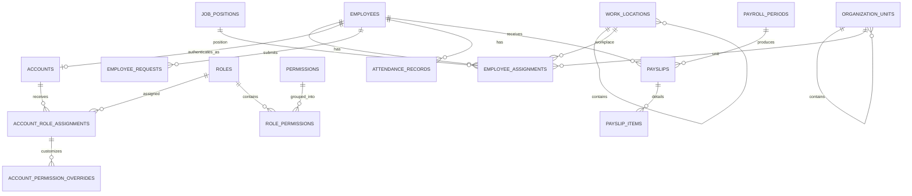

# Database Schema — HRM cho doanh nghiệp bán lẻ/phân phối

> Đây là bản thiết kế database để duyệt nghiệp vụ, chưa phải Flyway migration.
>
> Hệ thống phục vụ **một doanh nghiệp duy nhất**. Doanh nghiệp có một trụ sở chính, hai chi nhánh; trụ sở và mỗi chi nhánh có một kho. Kho chỉ là địa điểm làm việc/phạm vi quản lý nhân sự, không quản lý hàng hóa hay tồn kho.
>
> Phạm vi payroll: lương cơ bản, phụ cấp và tăng ca. Không tính hoa hồng, thưởng, bảo hiểm hoặc thuế.

---

## 1. Nguyên tắc thiết kế

- Database: PostgreSQL.
- Khóa chính dùng `BIGSERIAL`.
- Thời điểm dùng `TIMESTAMPTZ`, ngày nghiệp vụ dùng `DATE`.
- Tiền dùng `NUMERIC(15,2)`, hệ số dùng `NUMERIC(8,4)`, thời lượng dùng phút `INTEGER`.
- Hệ thống một doanh nghiệp nên không có `company_id` trong các bảng nghiệp vụ.
- Bảng danh mục được xóa mềm bằng `deleted_at`; bảng giao dịch/lịch sử không xóa mà đổi trạng thái.
- CCCD, tài khoản ngân hàng và lương là dữ liệu nhạy cảm, phải che hoặc mã hóa khi triển khai.
- Các bảng quan trọng lưu người thực hiện và thời điểm cập nhật; audit log chi tiết để ngoài phạm vi MVP.

### 1.1. Soft delete nhân sự

Nhân viên nghỉ việc không phải là bản ghi bị xóa:

```text
Nhân viên nghỉ việc
  → employees.employment_status = RESIGNED hoặc TERMINATED
  → employees.termination_date được cập nhật
  → kết thúc employee_assignments hiện tại
  → accounts.status = DISABLED
  → giữ nguyên đơn từ, chấm công và bảng lương
```

Chỉ hồ sơ được tạo nhầm mới dùng `employees.deleted_at`. Khi đó phải có `deleted_by_account_id` và `deletion_reason` để có thể kiểm tra, khôi phục.

### 1.2. Danh sách 19 bảng

| Nhóm | Các bảng |
|---|---|
| Doanh nghiệp và cơ cấu | `company_profile`, `work_locations`, `organization_units`, `job_positions` |
| Nhân sự | `employees`, `employee_assignments`, `employee_compensations` |
| Tài khoản và RBAC | `accounts`, `permissions`, `roles`, `role_permissions`, `account_role_assignments`, `account_permission_overrides` |
| Đơn từ | `employee_requests` |
| Chấm công | `work_shifts`, `attendance_records` |
| Tính lương | `payroll_periods`, `payslips`, `payslip_items` |

### 1.3. Sơ đồ quan hệ tổng quát



---

## 2. Doanh nghiệp và cơ cấu tổ chức

### `company_profile` — Thông tin doanh nghiệp

| Tên cột | Kiểu | Ràng buộc | Ý nghĩa |
|---|---|---|---|
| `id` | SMALLINT | PK, CHECK = 1 | Luôn là `1`, bảo đảm chỉ một doanh nghiệp |
| `code` | VARCHAR(30) | NOT NULL, UNIQUE | Mã doanh nghiệp |
| `name` | VARCHAR(200) | NOT NULL | Tên doanh nghiệp |
| `tax_code` | VARCHAR(30) | UNIQUE | Mã số thuế |
| `phone` | VARCHAR(20) | | Số điện thoại |
| `email` | VARCHAR(100) | | Email liên hệ |
| `address` | TEXT | | Địa chỉ đăng ký |
| `timezone` | VARCHAR(50) | NOT NULL, DEFAULT `Asia/Ho_Chi_Minh` | Múi giờ nghiệp vụ |
| `created_at` | TIMESTAMPTZ | NOT NULL | Thời điểm tạo |
| `updated_at` | TIMESTAMPTZ | NOT NULL | Thời điểm cập nhật |

> Bảng độc lập, không được tham chiếu bằng `company_id`. Mọi dữ liệu trong hệ thống mặc nhiên thuộc doanh nghiệp này.

### `work_locations` — Trụ sở, chi nhánh và kho

| Tên cột | Kiểu | Ràng buộc | Ý nghĩa |
|---|---|---|---|
| `id` | BIGSERIAL | PK | Khóa chính |
| `parent_location_id` | BIGINT | FK → work_locations | Trụ sở/chi nhánh cha của kho |
| `code` | VARCHAR(30) | NOT NULL | Mã địa điểm |
| `name` | VARCHAR(150) | NOT NULL | Tên địa điểm |
| `location_type` | VARCHAR(20) | NOT NULL | `HEAD_OFFICE` / `BRANCH` / `WAREHOUSE` |
| `address` | TEXT | NOT NULL | Địa chỉ làm việc |
| `phone` | VARCHAR(20) | | Số điện thoại |
| `is_active` | BOOLEAN | NOT NULL, DEFAULT true | Trạng thái hoạt động |
| `created_at` | TIMESTAMPTZ | NOT NULL | Thời điểm tạo |
| `updated_at` | TIMESTAMPTZ | NOT NULL | Thời điểm cập nhật |
| `deleted_at` | TIMESTAMPTZ | | Xóa mềm |

> `UNIQUE(code) WHERE deleted_at IS NULL`.
>
> Quy tắc:
>
> - `HEAD_OFFICE`, `BRANCH`: `parent_location_id IS NULL`.
> - `WAREHOUSE`: phải có cha là `HEAD_OFFICE` hoặc `BRANCH`.
> - Một trụ sở/chi nhánh chỉ có tối đa một kho chưa xóa: `UNIQUE(parent_location_id) WHERE location_type = 'WAREHOUSE' AND deleted_at IS NULL`.

### `organization_units` — Phòng ban và nhóm

| Tên cột | Kiểu | Ràng buộc | Ý nghĩa |
|---|---|---|---|
| `id` | BIGSERIAL | PK | Khóa chính |
| `parent_unit_id` | BIGINT | FK → organization_units | Đơn vị cha |
| `code` | VARCHAR(30) | NOT NULL | Mã đơn vị |
| `name` | VARCHAR(150) | NOT NULL | Tên phòng ban/nhóm |
| `unit_type` | VARCHAR(20) | NOT NULL | `BOARD` / `DEPARTMENT` / `TEAM` |
| `is_active` | BOOLEAN | NOT NULL, DEFAULT true | Trạng thái hoạt động |
| `created_at` | TIMESTAMPTZ | NOT NULL | Thời điểm tạo |
| `updated_at` | TIMESTAMPTZ | NOT NULL | Thời điểm cập nhật |
| `deleted_at` | TIMESTAMPTZ | | Xóa mềm |

> `UNIQUE(code) WHERE deleted_at IS NULL`. Phòng ban là cơ cấu quản trị, không đồng nhất với địa điểm làm việc.

### `job_positions` — Vị trí công việc

| Tên cột | Kiểu | Ràng buộc | Ý nghĩa |
|---|---|---|---|
| `id` | BIGSERIAL | PK | Khóa chính |
| `code` | VARCHAR(30) | NOT NULL | Mã vị trí |
| `title` | VARCHAR(150) | NOT NULL | Nhân viên nhân sự, thủ kho, kế toán lương... |
| `description` | TEXT | | Mô tả công việc |
| `is_managerial` | BOOLEAN | NOT NULL, DEFAULT false | Có phải vị trí quản lý |
| `is_active` | BOOLEAN | NOT NULL, DEFAULT true | Còn được sử dụng |
| `created_at` | TIMESTAMPTZ | NOT NULL | Thời điểm tạo |
| `updated_at` | TIMESTAMPTZ | NOT NULL | Thời điểm cập nhật |
| `deleted_at` | TIMESTAMPTZ | | Xóa mềm |

> `UNIQUE(code) WHERE deleted_at IS NULL`.

---

## 3. Hồ sơ và vòng đời nhân sự

### `employees` — Hồ sơ nhân sự

| Tên cột | Kiểu | Ràng buộc | Ý nghĩa |
|---|---|---|---|
| `id` | BIGSERIAL | PK | Khóa chính |
| `employee_code` | VARCHAR(30) | NOT NULL, UNIQUE | Mã nhân viên, không tái sử dụng |
| `full_name` | VARCHAR(200) | NOT NULL | Họ tên |
| `date_of_birth` | DATE | | Ngày sinh |
| `gender` | VARCHAR(20) | | `MALE` / `FEMALE` / `OTHER` / `UNDISCLOSED` |
| `highest_education_level` | VARCHAR(20) | | Trình độ cao nhất: `HIGH_SCHOOL` / `COLLEGE` / `BACHELOR` / `MASTER` / `DOCTORATE` |
| `major` | VARCHAR(200) | | Chuyên ngành của trình độ cao nhất |
| `institution` | VARCHAR(200) | | Cơ sở đào tạo |
| `graduation_year` | SMALLINT | | Năm tốt nghiệp |
| `national_id` | VARCHAR(30) | UNIQUE | CCCD/hộ chiếu |
| `personal_email` | VARCHAR(100) | | Email cá nhân |
| `work_email` | VARCHAR(100) | UNIQUE | Email công việc |
| `phone` | VARCHAR(20) | | Số điện thoại |
| `address` | TEXT | | Địa chỉ liên hệ |
| `tax_code` | VARCHAR(30) | | Mã số thuế cá nhân |
| `bank_name` | VARCHAR(150) | | Ngân hàng nhận lương |
| `bank_account_number` | VARCHAR(50) | | Số tài khoản |
| `bank_account_holder` | VARCHAR(200) | | Tên chủ tài khoản |
| `hire_date` | DATE | NOT NULL | Ngày vào làm |
| `employment_status` | VARCHAR(20) | NOT NULL | `PROBATION` / `ACTIVE` / `RESIGNED` / `TERMINATED` / `RETIRED` |
| `termination_date` | DATE | | Ngày làm việc cuối cùng |
| `termination_reason` | TEXT | | Lý do kết thúc làm việc |
| `created_at` | TIMESTAMPTZ | NOT NULL | Thời điểm tạo |
| `updated_at` | TIMESTAMPTZ | NOT NULL | Thời điểm cập nhật |
| `deleted_at` | TIMESTAMPTZ | | Chỉ dùng cho hồ sơ tạo nhầm |
| `deleted_by_account_id` | BIGINT | FK → accounts | Người thực hiện xóa mềm |
| `deletion_reason` | TEXT | | Lý do xóa mềm |

> Báo cáo trạng thái trong quá khứ dựa trên `hire_date`, `termination_date` và các đơn nghỉ đã duyệt. Không cần bảng lịch sử trạng thái riêng trong MVP.

### `employee_assignments` — Lịch sử phân công

| Tên cột | Kiểu | Ràng buộc | Ý nghĩa |
|---|---|---|---|
| `id` | BIGSERIAL | PK | Khóa chính |
| `employee_id` | BIGINT | FK → employees, NOT NULL | Nhân viên |
| `organization_unit_id` | BIGINT | FK → organization_units, NOT NULL | Phòng ban/nhóm |
| `work_location_id` | BIGINT | FK → work_locations, NOT NULL | Địa điểm làm việc |
| `position_id` | BIGINT | FK → job_positions, NOT NULL | Vị trí công việc |
| `shift_id` | BIGINT | FK → work_shifts | Ca làm việc hiện hành của phân công |
| `manager_employee_id` | BIGINT | FK → employees | Quản lý trực tiếp |
| `employment_type` | VARCHAR(20) | NOT NULL | `FULL_TIME` / `PART_TIME` / `TEMPORARY` |
| `effective_from` | DATE | NOT NULL | Ngày bắt đầu |
| `effective_to` | DATE | | Ngày kết thúc |
| `is_primary` | BOOLEAN | NOT NULL, DEFAULT true | Phân công chính |
| `reason` | TEXT | | Tuyển mới, điều chuyển, bổ nhiệm... |
| `created_by_account_id` | BIGINT | FK → accounts, NOT NULL | Người ghi nhận |
| `created_at` | TIMESTAMPTZ | NOT NULL | Thời điểm tạo |

> Khi điều chuyển hoặc đổi ca, đóng phân công hiện tại bằng `effective_to`, sau đó tạo bản ghi mới. Một nhân viên chỉ có một phân công chính hiệu lực tại một thời điểm.

### `employee_compensations` — Lương cơ bản và phụ cấp

| Tên cột | Kiểu | Ràng buộc | Ý nghĩa |
|---|---|---|---|
| `id` | BIGSERIAL | PK | Khóa chính |
| `employee_id` | BIGINT | FK → employees, NOT NULL | Nhân viên |
| `component_type` | VARCHAR(20) | NOT NULL | `BASIC_SALARY` / `ALLOWANCE` |
| `component_code` | VARCHAR(30) | NOT NULL | `BASE`, `LUNCH`, `PHONE`, `RESPONSIBILITY`... |
| `component_name` | VARCHAR(150) | NOT NULL | Tên khoản lương/phụ cấp |
| `monthly_amount` | NUMERIC(15,2) | NOT NULL, CHECK >= 0 | Số tiền theo tháng |
| `effective_from` | DATE | NOT NULL | Bắt đầu áp dụng |
| `effective_to` | DATE | | Kết thúc áp dụng |
| `approved_by_account_id` | BIGINT | FK → accounts, NOT NULL | Người duyệt |
| `note` | TEXT | | Ghi chú |
| `created_at` | TIMESTAMPTZ | NOT NULL | Thời điểm tạo |

> Mỗi nhân viên chỉ có một `BASIC_SALARY` hiệu lực tại một thời điểm. Cùng `component_code` không được chồng khoảng hiệu lực. Trong MVP, mọi thay đổi bắt đầu từ ngày đầu tháng.

---

## 4. Tài khoản và phân quyền RBAC

### `accounts` — Tài khoản đăng nhập

| Tên cột | Kiểu | Ràng buộc | Ý nghĩa |
|---|---|---|---|
| `id` | BIGSERIAL | PK | Khóa chính |
| `employee_id` | BIGINT | FK → employees, UNIQUE | Hồ sơ liên kết; null chỉ dành cho bootstrap admin |
| `username` | VARCHAR(50) | NOT NULL, UNIQUE | Tên đăng nhập, không tái sử dụng |
| `email` | VARCHAR(100) | NOT NULL, UNIQUE | Email đăng nhập |
| `password_hash` | VARCHAR(255) | NOT NULL | Mật khẩu đã hash |
| `status` | VARCHAR(20) | NOT NULL | `PENDING` / `ACTIVE` / `LOCKED` / `DISABLED` |
| `failed_login_count` | INTEGER | NOT NULL, DEFAULT 0 | Số lần đăng nhập sai liên tiếp |
| `locked_until` | TIMESTAMPTZ | | Khóa tạm đến thời điểm |
| `last_login_at` | TIMESTAMPTZ | | Lần đăng nhập gần nhất |
| `created_at` | TIMESTAMPTZ | NOT NULL | Thời điểm tạo |
| `updated_at` | TIMESTAMPTZ | NOT NULL | Thời điểm cập nhật |

> Người nghỉ việc có tài khoản chuyển `DISABLED`, không xóa tài khoản.

### `permissions` — Danh mục quyền nguyên tử

| Tên cột | Kiểu | Ràng buộc | Ý nghĩa |
|---|---|---|---|
| `id` | BIGSERIAL | PK | Khóa chính |
| `code` | VARCHAR(100) | NOT NULL, UNIQUE | Mã quyền, ví dụ `leave.approve` |
| `module` | VARCHAR(30) | NOT NULL | `EMPLOYEE` / `REQUEST` / `ATTENDANCE` / `PAYROLL` / `RBAC` / `REPORT` |
| `description` | TEXT | NOT NULL | Mô tả quyền |
| `is_active` | BOOLEAN | NOT NULL, DEFAULT true | Trạng thái |
| `created_at` | TIMESTAMPTZ | NOT NULL | Thời điểm tạo |

### `roles` — Mẫu vai trò

| Tên cột | Kiểu | Ràng buộc | Ý nghĩa |
|---|---|---|---|
| `id` | BIGSERIAL | PK | Khóa chính |
| `code` | VARCHAR(50) | NOT NULL, UNIQUE | Mã vai trò |
| `name` | VARCHAR(150) | NOT NULL | Tên hiển thị |
| `description` | TEXT | | Mô tả |
| `is_system` | BOOLEAN | NOT NULL, DEFAULT false | Vai trò seed, không được xóa |
| `is_active` | BOOLEAN | NOT NULL, DEFAULT true | Trạng thái |
| `created_at` | TIMESTAMPTZ | NOT NULL | Thời điểm tạo |
| `updated_at` | TIMESTAMPTZ | NOT NULL | Thời điểm cập nhật |
| `deleted_at` | TIMESTAMPTZ | | Chỉ áp dụng cho vai trò tùy chỉnh |

### `role_permissions` — Quyền mặc định của vai trò

| Tên cột | Kiểu | Ràng buộc | Ý nghĩa |
|---|---|---|---|
| `role_id` | BIGINT | PK, FK → roles | Vai trò |
| `permission_id` | BIGINT | PK, FK → permissions | Quyền được cấp |
| `created_by_account_id` | BIGINT | FK → accounts | Người cấu hình; null với seed |
| `created_at` | TIMESTAMPTZ | NOT NULL | Thời điểm cấp |

### `account_role_assignments` — Gán vai trò và phạm vi

| Tên cột | Kiểu | Ràng buộc | Ý nghĩa |
|---|---|---|---|
| `id` | BIGSERIAL | PK | Khóa chính |
| `account_id` | BIGINT | FK → accounts, NOT NULL | Tài khoản nhận vai trò |
| `role_id` | BIGINT | FK → roles, NOT NULL | Vai trò được gán |
| `scope_type` | VARCHAR(20) | NOT NULL | `SELF` / `COMPANY` / `ORG_UNIT` / `LOCATION` |
| `organization_unit_id` | BIGINT | FK → organization_units | Chỉ dùng với `ORG_UNIT` |
| `work_location_id` | BIGINT | FK → work_locations | Chỉ dùng với `LOCATION` |
| `effective_from` | DATE | NOT NULL | Ngày bắt đầu |
| `effective_to` | DATE | | Ngày kết thúc |
| `granted_by_account_id` | BIGINT | FK → accounts, NOT NULL | Người cấp |
| `reason` | TEXT | | Lý do cấp quyền |
| `created_at` | TIMESTAMPTZ | NOT NULL | Thời điểm tạo |

> Quy tắc scope:
>
> - `SELF`, `COMPANY`: hai FK phạm vi đều null.
> - `ORG_UNIT`: chỉ `organization_unit_id` có giá trị.
> - `LOCATION`: chỉ `work_location_id` có giá trị.
> - `ORG_UNIT` và `LOCATION` bao gồm nút được gán cùng toàn bộ nút con.
> - Một tài khoản có thể có nhiều vai trò; các quyền được cộng dồn.

### `account_permission_overrides` — Ngoại lệ quyền của từng nhân viên

| Tên cột | Kiểu | Ràng buộc | Ý nghĩa |
|---|---|---|---|
| `id` | BIGSERIAL | PK | Khóa chính |
| `account_role_assignment_id` | BIGINT | FK → account_role_assignments, NOT NULL | Lần gán vai trò được tùy chỉnh |
| `permission_id` | BIGINT | FK → permissions, NOT NULL | Quyền cần ghi đè |
| `effect` | VARCHAR(10) | NOT NULL | `GRANT` / `REVOKE` |
| `effective_from` | DATE | NOT NULL | Bắt đầu ngoại lệ |
| `effective_to` | DATE | | Kết thúc ngoại lệ |
| `reason` | TEXT | NOT NULL | Lý do bắt buộc |
| `granted_by_account_id` | BIGINT | FK → accounts, NOT NULL | Người thiết lập |
| `created_at` | TIMESTAMPTZ | NOT NULL | Thời điểm tạo |

> Ngoại lệ chỉ áp dụng cho một lần gán vai trò. Nếu vai trò khác vẫn cấp cùng quyền, tài khoản vẫn có quyền đó.

### 4.1. Vai trò và quyền mặc định

| Vai trò | Phạm vi thường dùng | Quyền mặc định chính |
|---|---|---|
| `EMPLOYEE` | `SELF` | Xem/sửa hồ sơ cho phép; gửi đơn; xem chấm công và phiếu lương |
| `TEAM_LEAD` | `ORG_UNIT` | Quyền nhân viên + xem nhân sự, duyệt đơn và tăng ca của nhóm |
| `WAREHOUSE_SUPERVISOR` | `LOCATION` | Như trưởng nhóm nhưng chỉ trong kho được giao |
| `BRANCH_MANAGER` | `LOCATION` | Thêm/xóa mềm nhân sự, duyệt đơn và quản lý chấm công trong chi nhánh cùng kho con |
| `HR_STAFF` | `COMPANY` | Hồ sơ thường và dữ liệu nhạy cảm của nhân viên, đơn từ, chấm công và báo cáo toàn công ty |
| `PAYROLL_ACCOUNTANT` | `COMPANY` | Đọc thành phần thu nhập, tính và kiểm tra lương |
| `PAYROLL_APPROVER` | `COMPANY` | Duyệt, xác nhận đã trả và khóa kỳ lương |
| `SYSTEM_ADMIN` | `COMPANY` | Tài khoản, vai trò và quyền; không mặc nhiên xem lương |

Mọi nhân viên có tài khoản đều nhận `EMPLOYEE` ở scope `SELF`; vai trò nghiệp vụ được gán thêm.

Các permission code tối thiểu:

```text
profile.self.read             profile.self.update
employee.read                employee.manage               employee.sensitive.read
employee.sensitive.manage
request.self.read            request.self.create           request.self.cancel
request.read                 request.approve               request.manage
attendance.self.read         attendance.read               attendance.manage
attendance.overtime.approve
payroll.self.read            payroll.self.print
compensation.read            compensation.manage
payroll.calculate            payroll.approve               payroll.mark_paid
payroll.lock                 report.hr.read                report.payroll.read
rbac.manage
```

---

## 5. Đơn nghỉ phép và nghỉ việc

### `employee_requests` — Đơn nghỉ phép hoặc nghỉ việc

| Tên cột | Kiểu | Ràng buộc | Ý nghĩa |
|---|---|---|---|
| `id` | BIGSERIAL | PK | Khóa chính |
| `employee_id` | BIGINT | FK → employees, NOT NULL | Người gửi đơn |
| `request_type` | VARCHAR(20) | NOT NULL | `LEAVE` / `RESIGNATION` |
| `leave_type` | VARCHAR(20) | | `ANNUAL` / `SICK` / `MATERNITY` / `UNPAID` / `OTHER`; chỉ dùng cho đơn nghỉ phép |
| `is_paid_leave` | BOOLEAN | | Nghỉ có hưởng lương hay không; chỉ dùng cho đơn nghỉ phép |
| `start_date` | DATE | | Ngày bắt đầu nghỉ phép |
| `end_date` | DATE | | Ngày kết thúc nghỉ phép |
| `total_days` | NUMERIC(6,2) | | Tổng số ngày nghỉ |
| `requested_last_working_date` | DATE | | Ngày làm việc cuối mong muốn |
| `reason` | TEXT | NOT NULL | Lý do |
| `attachment_url` | TEXT | | Minh chứng nếu có |
| `status` | VARCHAR(20) | NOT NULL | `DRAFT` / `PENDING` / `APPROVED` / `REJECTED` / `CANCELLED` / `COMPLETED` |
| `submitted_at` | TIMESTAMPTZ | | Thời điểm nộp |
| `reviewed_by_account_id` | BIGINT | FK → accounts | Người duyệt |
| `review_comment` | TEXT | | Ý kiến duyệt/từ chối |
| `reviewed_at` | TIMESTAMPTZ | | Thời điểm duyệt |
| `created_at` | TIMESTAMPTZ | NOT NULL | Thời điểm tạo |
| `updated_at` | TIMESTAMPTZ | NOT NULL | Thời điểm cập nhật |

> CHECK theo loại:
>
> - `LEAVE`: có `leave_type`, `is_paid_leave`, `start_date`, `end_date`, `total_days`; không có `requested_last_working_date`.
> - `RESIGNATION`: có `requested_last_working_date`; các trường nghỉ phép và `is_paid_leave` phải null.
> - Chỉ đơn `DRAFT` được sửa nội dung.

> Mỗi đơn chỉ có một người duyệt. `status` lưu kết quả; ba cột `reviewed_*` lưu người, thời điểm và nhận xét.

---

## 6. Ca làm việc, chấm công và tăng ca

### `work_shifts` — Danh mục ca làm việc

| Tên cột | Kiểu | Ràng buộc | Ý nghĩa |
|---|---|---|---|
| `id` | BIGSERIAL | PK | Khóa chính |
| `code` | VARCHAR(30) | NOT NULL | Mã ca |
| `name` | VARCHAR(100) | NOT NULL | Tên ca |
| `start_time` | TIME | NOT NULL | Giờ bắt đầu |
| `end_time` | TIME | NOT NULL | Giờ kết thúc |
| `break_minutes` | INTEGER | NOT NULL, DEFAULT 0, CHECK >= 0 | Thời gian nghỉ |
| `standard_work_minutes` | INTEGER | NOT NULL, CHECK > 0 | Phút công chuẩn |
| `grace_late_minutes` | INTEGER | NOT NULL, DEFAULT 0, CHECK >= 0 | Khoảng trễ cho phép |
| `crosses_midnight` | BOOLEAN | NOT NULL, DEFAULT false | Ca qua ngày |
| `is_active` | BOOLEAN | NOT NULL, DEFAULT true | Trạng thái |
| `created_at` | TIMESTAMPTZ | NOT NULL | Thời điểm tạo |
| `updated_at` | TIMESTAMPTZ | NOT NULL | Thời điểm cập nhật |
| `deleted_at` | TIMESTAMPTZ | | Xóa mềm |

> `UNIQUE(code) WHERE deleted_at IS NULL`.

### `attendance_records` — Chấm công hằng ngày

| Tên cột | Kiểu | Ràng buộc | Ý nghĩa |
|---|---|---|---|
| `id` | BIGSERIAL | PK | Khóa chính |
| `employee_id` | BIGINT | FK → employees, NOT NULL | Nhân viên |
| `work_date` | DATE | NOT NULL | Ngày công |
| `shift_id` | BIGINT | FK → work_shifts, NOT NULL | Ca áp dụng |
| `scheduled_start_at` | TIMESTAMPTZ | NOT NULL | Giờ vào dự kiến được snapshot |
| `scheduled_end_at` | TIMESTAMPTZ | NOT NULL | Giờ ra dự kiến được snapshot |
| `check_in_at` | TIMESTAMPTZ | | Giờ vào thực tế |
| `check_out_at` | TIMESTAMPTZ | | Giờ ra thực tế |
| `worked_minutes` | INTEGER | NOT NULL, DEFAULT 0, CHECK >= 0 | Phút làm thực tế |
| `payable_minutes` | INTEGER | NOT NULL, DEFAULT 0, CHECK >= 0 | Phút được tính lương cơ bản |
| `late_minutes` | INTEGER | NOT NULL, DEFAULT 0, CHECK >= 0 | Phút đi trễ |
| `early_leave_minutes` | INTEGER | NOT NULL, DEFAULT 0, CHECK >= 0 | Phút về sớm |
| `overtime_minutes` | INTEGER | NOT NULL, DEFAULT 0, CHECK >= 0 | Phút tăng ca đã được duyệt để tính lương |
| `overtime_multiplier` | NUMERIC(8,4) | NOT NULL, DEFAULT 1, CHECK > 0 | Hệ số tăng ca, ví dụ 1.5/2.0/3.0 |
| `overtime_approved_by_account_id` | BIGINT | FK → accounts | Người duyệt số phút tăng ca |
| `overtime_approved_at` | TIMESTAMPTZ | | Thời điểm duyệt tăng ca |
| `status` | VARCHAR(20) | NOT NULL | `PRESENT` / `ABSENT` / `PAID_LEAVE` / `UNPAID_LEAVE` / `HOLIDAY` / `MISSING_PUNCH` |
| `note` | TEXT | | Lý do điều chỉnh thủ công |
| `updated_by_account_id` | BIGINT | FK → accounts | Người sửa cuối |
| `created_at` | TIMESTAMPTZ | NOT NULL | Thời điểm tạo |
| `updated_at` | TIMESTAMPTZ | NOT NULL | Thời điểm cập nhật |

> `UNIQUE(employee_id, work_date)`. Nếu cần sửa công, HR ghi lý do vào `note`; `updated_by_account_id` và `updated_at` cho biết ai sửa và sửa lúc nào. Hệ thống không còn quy trình đăng ký tăng ca riêng: người có quyền `attendance.overtime.approve` nhập trực tiếp số phút và hệ số tăng ca được duyệt vào bản ghi chấm công.

---

## 7. Tính lương

### 7.1. Công thức

```text
Lương giờ = Lương cơ bản tháng / Tổng phút công chuẩn của kỳ × 60

Lương cơ bản thực nhận
  = Lương cơ bản tháng × Phút công được hưởng lương / Tổng phút công chuẩn

Tiền tăng ca
  = Σ (Số giờ tăng ca được duyệt × Lương giờ × Hệ số tăng ca)

Thực nhận
  = Lương cơ bản thực nhận + Tổng phụ cấp + Tiền tăng ca
```

- Nghỉ có lương và ngày lễ có lương được tính vào `payable_minutes`.
- Nghỉ không lương làm giảm `payable_minutes`.
- Kỳ lương chỉ được tính khi chấm công và tăng ca trong tháng đã hoàn tất.
- Trước khi duyệt có thể tính lại và thay thế phiếu nháp; từ `APPROVED` trở đi dữ liệu bất biến.

### `payroll_periods` — Kỳ lương tháng

| Tên cột | Kiểu | Ràng buộc | Ý nghĩa |
|---|---|---|---|
| `id` | BIGSERIAL | PK | Khóa chính |
| `year` | SMALLINT | NOT NULL | Năm lương |
| `month` | SMALLINT | NOT NULL, CHECK 1..12 | Tháng lương |
| `period_start` | DATE | NOT NULL | Ngày đầu kỳ |
| `period_end` | DATE | NOT NULL | Ngày cuối kỳ |
| `status` | VARCHAR(20) | NOT NULL | Trạng thái vòng đời |
| `calculated_by_account_id` | BIGINT | FK → accounts | Người tính |
| `calculated_at` | TIMESTAMPTZ | | Thời điểm tính gần nhất |
| `approved_by_account_id` | BIGINT | FK → accounts | Người duyệt |
| `approved_at` | TIMESTAMPTZ | | Thời điểm duyệt |
| `paid_by_account_id` | BIGINT | FK → accounts | Người xác nhận đã trả |
| `paid_at` | TIMESTAMPTZ | | Thời điểm xác nhận |
| `locked_by_account_id` | BIGINT | FK → accounts | Người khóa |
| `locked_at` | TIMESTAMPTZ | | Thời điểm khóa |
| `created_at` | TIMESTAMPTZ | NOT NULL | Thời điểm tạo |
| `updated_at` | TIMESTAMPTZ | NOT NULL | Thời điểm cập nhật |

> `UNIQUE(year, month)`. Trạng thái: `DRAFT` → `CALCULATED` → `APPROVED` → `PAID` → `LOCKED`; có thể `CANCELLED` trước khi duyệt. Người tính không được là người duyệt.

### `payslips` — Phiếu lương nhân viên

| Tên cột | Kiểu | Ràng buộc | Ý nghĩa |
|---|---|---|---|
| `id` | BIGSERIAL | PK | Khóa chính |
| `payroll_period_id` | BIGINT | FK → payroll_periods, NOT NULL | Kỳ lương |
| `employee_id` | BIGINT | FK → employees, NOT NULL | Nhân viên |
| `employee_code_snapshot` | VARCHAR(30) | NOT NULL | Mã nhân viên lúc tính |
| `employee_name_snapshot` | VARCHAR(200) | NOT NULL | Tên nhân viên lúc tính |
| `work_location_snapshot` | VARCHAR(150) | NOT NULL | Địa điểm lúc tính |
| `organization_unit_snapshot` | VARCHAR(150) | NOT NULL | Phòng ban lúc tính |
| `contractual_basic_salary` | NUMERIC(15,2) | NOT NULL, CHECK >= 0 | Lương tháng cấu hình |
| `scheduled_work_minutes` | INTEGER | NOT NULL, CHECK > 0 | Phút công chuẩn |
| `payable_work_minutes` | INTEGER | NOT NULL, CHECK >= 0 | Phút được hưởng lương |
| `approved_overtime_minutes` | INTEGER | NOT NULL, DEFAULT 0, CHECK >= 0 | Phút tăng ca đã duyệt |
| `basic_salary_pay` | NUMERIC(15,2) | NOT NULL, CHECK >= 0 | Lương cơ bản thực nhận |
| `allowance_pay` | NUMERIC(15,2) | NOT NULL, DEFAULT 0, CHECK >= 0 | Tổng phụ cấp |
| `overtime_pay` | NUMERIC(15,2) | NOT NULL, DEFAULT 0, CHECK >= 0 | Tổng tăng ca |
| `gross_pay` | NUMERIC(15,2) | NOT NULL, CHECK >= 0 | Tổng thu nhập |
| `net_pay` | NUMERIC(15,2) | NOT NULL, CHECK >= 0 | Thực nhận; hiện bằng gross |
| `created_at` | TIMESTAMPTZ | NOT NULL | Thời điểm tạo |
| `updated_at` | TIMESTAMPTZ | NOT NULL | Chỉ cập nhật khi kỳ chưa duyệt |

> `UNIQUE(payroll_period_id, employee_id)`. Các trường snapshot giúp phiếu lương cũ không thay đổi khi nhân viên đổi tên, phòng ban hoặc mức lương.

### `payslip_items` — Chi tiết khoản lương

| Tên cột | Kiểu | Ràng buộc | Ý nghĩa |
|---|---|---|---|
| `id` | BIGSERIAL | PK | Khóa chính |
| `payslip_id` | BIGINT | FK → payslips, NOT NULL | Phiếu lương |
| `component_type` | VARCHAR(20) | NOT NULL | `BASIC_SALARY` / `ALLOWANCE` / `OVERTIME` |
| `description` | VARCHAR(250) | NOT NULL | Mô tả được snapshot |
| `quantity` | NUMERIC(12,4) | NOT NULL, DEFAULT 1 | Ngày/giờ/số lượng |
| `unit_rate` | NUMERIC(15,4) | NOT NULL, CHECK >= 0 | Đơn giá snapshot |
| `multiplier` | NUMERIC(8,4) | NOT NULL, DEFAULT 1, CHECK > 0 | Hệ số snapshot |
| `amount` | NUMERIC(15,2) | NOT NULL, CHECK >= 0 | Thành tiền |
| `created_at` | TIMESTAMPTZ | NOT NULL | Thời điểm tạo |

> Các dòng là dữ liệu snapshot dùng để giải thích cách hình thành phiếu lương, không giữ khóa ngoại về dữ liệu nguồn. Khi kỳ lương đạt `APPROVED`, không được xóa hoặc sửa các dòng này.

---

## 8. Báo cáo đáp ứng đề bài

Không cần bảng báo cáo riêng. Báo cáo được tổng hợp từ dữ liệu nguồn:

| Báo cáo | Nguồn dữ liệu |
|---|---|
| Nhân sự đang làm/nghỉ phép/nghỉ việc theo tháng | `employees`, `employee_requests` |
| Nhân sự theo trụ sở/chi nhánh/kho | `employee_assignments`, `work_locations` |
| Nhân sự theo phòng ban và vị trí | `employee_assignments`, `organization_units`, `job_positions` |
| Trình độ nhân sự | `employees.highest_education_level` |
| Thâm niên | `employees.hire_date` |
| Chấm công, đi trễ, vắng mặt | `attendance_records` |
| Tổng lương theo tháng/đơn vị/địa điểm | `payroll_periods`, `payslips` |
| Phiếu lương tháng của nhân viên | `payslips`, `payslip_items` |
| Bảng lương năm của nhân viên | Tổng hợp 12 tháng từ `payslips` |
| Lịch sử phân quyền | `account_role_assignments`, `account_permission_overrides` |

---

## 9. Indexes quan trọng

```sql
CREATE INDEX idx_locations_parent
  ON work_locations (parent_location_id) WHERE deleted_at IS NULL;
CREATE INDEX idx_units_parent
  ON organization_units (parent_unit_id) WHERE deleted_at IS NULL;
CREATE INDEX idx_employees_status
  ON employees (employment_status) WHERE deleted_at IS NULL;
CREATE INDEX idx_assignments_employee_period
  ON employee_assignments (employee_id, effective_from, effective_to);
CREATE INDEX idx_assignments_location_period
  ON employee_assignments (work_location_id, effective_from, effective_to);
CREATE INDEX idx_assignments_unit_period
  ON employee_assignments (organization_unit_id, effective_from, effective_to);
CREATE INDEX idx_compensations_employee_period
  ON employee_compensations (employee_id, effective_from, effective_to);
CREATE INDEX idx_role_assignments_account_period
  ON account_role_assignments (account_id, effective_from, effective_to);
CREATE INDEX idx_permission_overrides_assignment
  ON account_permission_overrides (account_role_assignment_id, effective_from, effective_to);
CREATE INDEX idx_requests_employee_status
  ON employee_requests (employee_id, status, submitted_at DESC);
CREATE INDEX idx_requests_type_status
  ON employee_requests (request_type, status);
CREATE INDEX idx_attendance_employee_date
  ON attendance_records (employee_id, work_date DESC);
CREATE INDEX idx_payslips_employee_period
  ON payslips (employee_id, payroll_period_id);
CREATE INDEX idx_payslip_items_payslip
  ON payslip_items (payslip_id);
```

---

## 10. Constraints và quy tắc nghiệp vụ

### 10.1. CHECK constraints chính

```sql
ALTER TABLE company_profile ADD CONSTRAINT chk_single_company
  CHECK (id = 1);

ALTER TABLE work_locations ADD CONSTRAINT chk_location_type
  CHECK (location_type IN ('HEAD_OFFICE', 'BRANCH', 'WAREHOUSE'));

ALTER TABLE employees ADD CONSTRAINT chk_employee_status
  CHECK (employment_status IN ('PROBATION', 'ACTIVE', 'RESIGNED', 'TERMINATED', 'RETIRED'));

ALTER TABLE employee_requests ADD CONSTRAINT chk_request_fields
  CHECK (
    (
      request_type = 'LEAVE'
      AND leave_type IS NOT NULL
      AND leave_type IN ('ANNUAL', 'SICK', 'MATERNITY', 'UNPAID', 'OTHER')
      AND is_paid_leave IS NOT NULL
      AND start_date IS NOT NULL
      AND end_date IS NOT NULL
      AND end_date >= start_date
      AND total_days IS NOT NULL
      AND total_days > 0
      AND requested_last_working_date IS NULL
    )
    OR (
      request_type = 'RESIGNATION'
      AND requested_last_working_date IS NOT NULL
      AND leave_type IS NULL
      AND is_paid_leave IS NULL
      AND start_date IS NULL
      AND end_date IS NULL
      AND total_days IS NULL
    )
  );

ALTER TABLE employee_requests ADD CONSTRAINT chk_request_status
  CHECK (status IN ('DRAFT', 'PENDING', 'APPROVED', 'REJECTED', 'CANCELLED', 'COMPLETED'));

ALTER TABLE accounts ADD CONSTRAINT chk_account_status
  CHECK (status IN ('PENDING', 'ACTIVE', 'LOCKED', 'DISABLED'));

ALTER TABLE account_role_assignments ADD CONSTRAINT chk_role_scope
  CHECK (
    (scope_type IN ('SELF', 'COMPANY') AND organization_unit_id IS NULL AND work_location_id IS NULL)
    OR (scope_type = 'ORG_UNIT' AND organization_unit_id IS NOT NULL AND work_location_id IS NULL)
    OR (scope_type = 'LOCATION' AND organization_unit_id IS NULL AND work_location_id IS NOT NULL)
  );

ALTER TABLE account_permission_overrides ADD CONSTRAINT chk_override_effect
  CHECK (effect IN ('GRANT', 'REVOKE'));

ALTER TABLE employee_compensations ADD CONSTRAINT chk_compensation_type
  CHECK (component_type IN ('BASIC_SALARY', 'ALLOWANCE'));

ALTER TABLE attendance_records ADD CONSTRAINT chk_attendance_overtime_approval
  CHECK (
    overtime_minutes = 0
    OR (
      overtime_minutes > 0
      AND overtime_approved_by_account_id IS NOT NULL
      AND overtime_approved_at IS NOT NULL
    )
  );

ALTER TABLE payroll_periods ADD CONSTRAINT chk_payroll_status
  CHECK (status IN ('DRAFT', 'CALCULATED', 'APPROVED', 'PAID', 'LOCKED', 'CANCELLED'));

ALTER TABLE payslips ADD CONSTRAINT chk_payslip_total
  CHECK (gross_pay = basic_salary_pay + allowance_pay + overtime_pay AND net_pay = gross_pay);
```

### 10.2. Quy tắc do Service layer kiểm tra

- Kho phải có cha là trụ sở hoặc chi nhánh; trụ sở/chi nhánh không có cha.
- Quản lý trực tiếp không được là chính nhân viên.
- Phân công chính và các khoản compensation của cùng nhân viên không được chồng khoảng hiệu lực.
- Mỗi nhân viên chỉ có một lương cơ bản hiệu lực tại một thời điểm.
- Khi hoàn tất đơn nghỉ việc: cập nhật nhân viên, kết thúc phân công và disable tài khoản trong cùng transaction.
- Người duyệt chỉ được xử lý đơn thuộc phạm vi quyền hiệu lực.
- Bản ghi chấm công đã dùng trong kỳ lương `APPROVED` trở lên không được sửa.
- Chỉ số phút tăng ca đã có người duyệt và thời điểm duyệt mới được đưa vào lương; tổng phút tăng ca trên phiếu lương phải được tổng hợp từ các bản ghi chấm công thuộc đúng kỳ.
- Tổng các `payslip_items` phải bằng các tổng tương ứng trên `payslips`.
- Người tính lương không được đồng thời là người duyệt.
- Kỳ lương từ `APPROVED` trở đi cùng phiếu lương con là immutable.

---

## 11. Dữ liệu demo tối thiểu

### 11.1. Địa điểm

| Code | Loại | Cha |
|---|---|---|
| `HO` | `HEAD_OFFICE` | — |
| `HO-WH` | `WAREHOUSE` | `HO` |
| `BRANCH-01` | `BRANCH` | — |
| `BRANCH-01-WH` | `WAREHOUSE` | `BRANCH-01` |
| `BRANCH-02` | `BRANCH` | — |
| `BRANCH-02-WH` | `WAREHOUSE` | `BRANCH-02` |

### 11.2. Tài khoản test

| Username | Vai trò | Phạm vi |
|---|---|---|
| `admin` | `SYSTEM_ADMIN` | Công ty |
| `hr01` | `HR_STAFF` | Công ty |
| `payroll01` | `PAYROLL_ACCOUNTANT` | Công ty |
| `payroll_approver` | `PAYROLL_APPROVER` | Công ty |
| `branch01_manager` | `BRANCH_MANAGER` | Chi nhánh 1 và kho con |
| `warehouse01_manager` | `WAREHOUSE_SUPERVISOR` | Kho chi nhánh 1 |
| `employee01` | `EMPLOYEE` | Bản thân |

Ít nhất một tài khoản có ngoại lệ quyền có thời hạn để demo bật/tắt quyền.

### 11.3. Giao dịch demo

- Nhân viên thử việc, đang làm và đã nghỉ việc.
- Một lần điều chuyển từ trụ sở sang chi nhánh.
- Đơn nghỉ phép được duyệt/từ chối và đơn nghỉ việc hoàn tất.
- Chấm công đi trễ, nghỉ có lương và nghỉ không lương.
- Tăng ca ngày thường và cuối tuần đã duyệt.
- Một kỳ lương `LOCKED` và một kỳ `DRAFT`.
- Dữ liệu đủ để in phiếu lương tháng và bảng lương năm.

---

## 12. Ngoài phạm vi

- Sản phẩm, tồn kho, nhập kho, xuất kho và điều chuyển hàng.
- Khách hàng, nhà cung cấp, đơn bán và doanh thu.
- Tuyển dụng ứng viên, phỏng vấn, KPI và đào tạo.
- Số dư phép năm và quy tắc cộng phép phức tạp.
- Hoa hồng, thưởng, bảo hiểm, thuế và quyết toán thuế.
- Tích hợp máy chấm công vật lý.
- Nhật ký audit chi tiết cho toàn bộ thay đổi dữ liệu.
- Multi-tenant, subscription và quản lý nhiều doanh nghiệp.

Các chức năng này không được thêm bảng dự phòng vào migration hiện tại.
