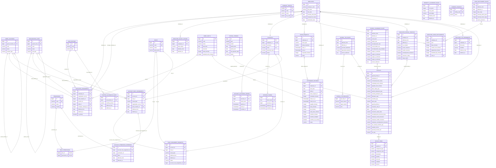

# Database Schema — Hệ thống quản lý nhân sự HRM

> Đây là tài liệu schema hiện hành, mô tả database runtime do Flyway tạo từ các migration trong
> `api/src/main/resources/db/migration/`. Định nghĩa bảng và cột đầy đủ nằm ở các mục 1–14;
> mục 15 cho biết bảng nào nằm trong file migration nào. Khi tài liệu khác với database,
> migration là nguồn chuẩn.
>
> Hệ thống phục vụ một doanh nghiệp bán lẻ/phân phối có trụ sở, chi nhánh và kho. Kho được xem là địa điểm làm việc, không quản lý hàng hóa hoặc tồn kho.
>
> Phạm vi tính lương hiện tại gồm lương cơ bản, phụ cấp chức vụ, phụ cấp thâm niên, tăng ca,
> bảo hiểm phần nhân viên và thuế TNCN cho người cư trú trong năm 2026. Thưởng, hoa hồng,
> quyết toán năm và các ngoại lệ ngoài phạm vi nêu trong [PAYROLL.md](../api/PAYROLL.md) chưa được tự động hóa.

---

## 1. Nguyên tắc thiết kế

- Database: PostgreSQL.
- Khóa chính dùng `BIGSERIAL`.
- Thời điểm dùng `TIMESTAMPTZ`, ngày nghiệp vụ dùng `DATE`.
- Tiền dùng `NUMERIC(15,2)`, phần trăm/hệ số dùng `NUMERIC(8,4)`, thời lượng dùng phút `INTEGER`.
- Hệ thống chỉ phục vụ một doanh nghiệp nên không lặp `company_id` trong các bảng nghiệp vụ.
- Bảng danh mục được xóa mềm bằng `deleted_at`; bảng giao dịch và lịch sử không xóa mà đổi trạng thái.
- Lương, CCCD và tài khoản ngân hàng là dữ liệu nhạy cảm, phải che hoặc mã hóa khi triển khai.
- Lương cơ bản và các chính sách phụ cấp phải có thời gian hiệu lực để tính lại đúng dữ liệu lịch sử.
- Phiếu lương đã duyệt là dữ liệu snapshot và không thay đổi khi chính sách hoặc thông tin nhân viên thay đổi sau này.

### 1.1. Xử lý nhân viên nghỉ việc

Nhân viên nghỉ việc không bị xóa khỏi hệ thống:

```text
Nhân viên nghỉ việc
  → employees.employment_status = RESIGNED hoặc TERMINATED
  → employees.termination_date được cập nhật
  → kết thúc employee_assignments hiện tại
  → accounts.status = DISABLED
  → giữ nguyên chấm công và phiếu lương lịch sử
```

Chỉ hồ sơ được tạo nhầm mới dùng `employees.deleted_at`.

### 1.2. Danh sách 32 bảng nghiệp vụ

| Nhóm | Các bảng |
|---|---|
| Doanh nghiệp và cơ cấu | `company_profile`, `work_locations`, `organization_units`, `job_positions` |
| Nhân sự và lương thỏa thuận | `employees`, `employee_assignments`, `employee_salary_history` |
| Chính sách phụ cấp | `position_allowance_rules`, `seniority_allowance_rules` |
| Tài khoản và RBAC | `accounts`, `account_activation_tokens`, `refresh_tokens`, `permissions`, `roles`, `role_permissions`, `role_assignment_requests`, `account_role_assignments`, `account_permission_overrides` |
| Nghỉ phép | `leave_requests`, `leave_entitlement_rules`, `employee_leave_entitlements` |
| Lịch và chấm công | `company_holidays`, `work_shifts`, `attendance_records` |
| Hồ sơ khấu trừ | `employee_payroll_profiles`, `employee_tax_dependents` |
| Quy tắc thuế và bảo hiểm | `payroll_tax_rules`, `payroll_tax_brackets`, `payroll_insurance_rules` |
| Tính lương | `payroll_periods`, `payslips`, `payslip_items` |

Bảng kỹ thuật `employee_code_counters` không nằm trong con số 32 này. Tính cả nó, database
runtime có 33 bảng (chưa kể bảng `flyway_schema_history` của Flyway).

### 1.3. Sơ đồ quan hệ tổng quát

Sơ đồ có đủ 32 bảng nghiệp vụ và các thuộc tính nghiệp vụ chính. Các cột kỹ thuật, người tạo/người duyệt và quan hệ kiểm toán được trình bày trong phần định nghĩa bảng bên dưới để sơ đồ dễ đọc. Chính sách thâm niên được áp dụng bằng thuật toán theo số năm và thời gian hiệu lực, không có khóa ngoại trực tiếp từ nhân viên. `company_holidays` đứng độc lập trong sơ đồ vì nó sửa lịch làm việc chung chứ không tham chiếu bản ghi nào.


```mermaid
erDiagram
    direction TB

    COMPANY_PROFILE {
        smallint id PK
        varchar code UK
        varchar name
        varchar tax_code UK
    }

    WORK_LOCATIONS {
        bigint id PK
        bigint parent_location_id FK
        varchar code
        varchar name
        varchar location_type
    }

    ORGANIZATION_UNITS {
        bigint id PK
        bigint parent_unit_id FK
        varchar code
        varchar name
        varchar unit_type
    }

    JOB_POSITIONS {
        bigint id PK
        varchar code
        varchar title
    }

    EMPLOYEES {
        bigint id PK
        varchar employee_code UK
        varchar full_name
        date hire_date
        date seniority_start_date
        varchar employment_status
        date termination_date
    }

    EMPLOYEE_ASSIGNMENTS {
        bigint id PK
        bigint employee_id FK
        bigint organization_unit_id FK
        bigint work_location_id FK
        bigint position_id FK
        bigint shift_id FK
        bigint manager_employee_id FK
        date effective_from
        date effective_to
        boolean is_primary
    }

    EMPLOYEE_SALARY_HISTORY {
        bigint id PK
        bigint employee_id FK
        numeric base_salary
        date effective_from
        date effective_to
    }

    POSITION_ALLOWANCE_RULES {
        bigint id PK
        bigint job_position_id FK
        numeric monthly_amount
        date effective_from
        date effective_to
    }

    SENIORITY_ALLOWANCE_RULES {
        bigint id PK
        integer min_years
        integer max_years
        numeric percentage
        date effective_from
        date effective_to
    }

    ACCOUNTS {
        bigint id PK
        bigint employee_id FK,UK
        varchar username UK
        varchar email UK
        varchar password_hash
        varchar status
    }

    ACCOUNT_ACTIVATION_TOKENS {
        bigint id PK
        bigint account_id FK
        char token_hash UK
        timestamptz expires_at
        timestamptz used_at
        timestamptz revoked_at
    }

    REFRESH_TOKENS {
        bigint id PK
        char token_hash UK
        bigint account_id FK
        timestamptz expires_at
        timestamptz revoked_at
    }

    PERMISSIONS {
        bigint id PK
        varchar code UK
        varchar name
        varchar module
    }

    ROLES {
        bigint id PK
        varchar code UK
        varchar name
        varchar grant_policy
    }

    ROLE_PERMISSIONS {
        bigint role_id PK,FK
        bigint permission_id PK,FK
    }

    ROLE_ASSIGNMENT_REQUESTS {
        bigint id PK
        bigint account_id FK
        bigint role_id FK
        varchar scope_type
        date effective_from
        date effective_to
        varchar status
        bigint account_role_assignment_id FK
    }

    ACCOUNT_ROLE_ASSIGNMENTS {
        bigint id PK
        bigint account_id FK
        bigint role_id FK
        varchar scope_type
        bigint organization_unit_id FK
        bigint work_location_id FK
        date effective_from
        date effective_to
    }

    ACCOUNT_PERMISSION_OVERRIDES {
        bigint id PK
        bigint account_role_assignment_id FK
        bigint permission_id FK
        varchar effect
        date effective_from
        date effective_to
    }

    LEAVE_REQUESTS {
        bigint id PK
        bigint employee_id FK
        varchar leave_type
        varchar salary_treatment
        timestamptz start_at
        timestamptz end_at
        integer requested_minutes
        varchar status
    }

    WORK_SHIFTS {
        bigint id PK
        varchar code
        varchar name
        time start_time
        time end_time
        integer break_minutes
        integer standard_work_minutes
    }

    ATTENDANCE_RECORDS {
        bigint id PK
        bigint employee_id FK
        date work_date
        bigint shift_id FK
        bigint leave_request_id FK
        integer scheduled_minutes
        timestamptz check_in_at
        timestamptz check_out_at
        integer payable_minutes
        integer leave_minutes
        integer late_minutes
        integer early_leave_minutes
        integer overtime_minutes
        numeric overtime_multiplier
        boolean overtime_tax_exempt
        varchar status
    }

    PAYROLL_PERIODS {
        bigint id PK
        smallint year
        smallint month
        date period_start
        date period_end
        date tax_payment_date
        varchar status
    }

    PAYSLIPS {
        bigint id PK
        bigint payroll_period_id FK
        bigint employee_id FK
        numeric contractual_base_salary
        integer scheduled_work_minutes
        integer payable_work_minutes
        numeric base_salary_pay
        numeric position_allowance_pay
        numeric seniority_allowance_pay
        numeric allowance_pay
        numeric overtime_pay
        numeric gross_pay
        bigint payroll_profile_id FK
        bigint insurance_rule_id FK
        bigint tax_rule_id FK
        numeric insurance_salary_base
        numeric unemployment_insurance_base
        numeric employee_social_insurance
        numeric employee_health_insurance
        numeric employee_unemployment_insurance
        numeric tax_exempt_overtime_pay
        numeric taxable_income
        numeric personal_income_tax
        numeric net_pay
    }

    COMPANY_HOLIDAYS {
        bigint id PK
        date holiday_date UK
        varchar name
    }

    LEAVE_ENTITLEMENT_RULES {
        bigint id PK
        date effective_from
        date effective_to
        integer base_days
        integer seniority_block_years
        integer seniority_bonus_days
        text source_reference
    }

    EMPLOYEE_LEAVE_ENTITLEMENTS {
        bigint id PK
        bigint employee_id FK
        smallint year
        integer base_minutes
        integer carried_over_minutes
        integer adjustment_minutes
        integer standard_day_minutes
        bigint rule_id FK
    }

    EMPLOYEE_PAYROLL_PROFILES {
        bigint id PK
        bigint employee_id FK
        date effective_from
        date effective_to
        boolean tax_resident
        boolean social_insurance
        boolean health_insurance
        boolean unemployment_insurance
        numeric insurance_salary
        smallint wage_region
    }

    EMPLOYEE_TAX_DEPENDENTS {
        bigint id PK
        bigint employee_id FK
        varchar full_name
        varchar identifier
        date effective_from
        date effective_to
    }

    PAYROLL_TAX_RULES {
        bigint id PK
        date effective_from
        date effective_to
        numeric personal_deduction
        numeric dependent_deduction
        text source_reference
    }

    PAYROLL_TAX_BRACKETS {
        bigint tax_rule_id PK
        numeric lower_bound PK
        numeric upper_bound
        numeric rate
    }

    PAYROLL_INSURANCE_RULES {
        bigint id PK
        date effective_from
        date effective_to
        numeric social_rate
        numeric health_rate
        numeric unemployment_rate
        numeric social_health_cap
        integer unemployment_cap_multiplier
        numeric region_1_minimum
        numeric region_2_minimum
        numeric region_3_minimum
        numeric region_4_minimum
        text source_reference
    }

    PAYSLIP_ITEMS {
        bigint id PK
        bigint payslip_id FK
        varchar component_type
        varchar component_code
        varchar description
        numeric quantity
        numeric unit_rate
        numeric multiplier
        numeric amount
    }

    WORK_LOCATIONS |o--o{ WORK_LOCATIONS : parent_location_id
    ORGANIZATION_UNITS |o--o{ ORGANIZATION_UNITS : parent_unit_id
    EMPLOYEES ||--o{ EMPLOYEE_ASSIGNMENTS : employee_id
    ORGANIZATION_UNITS ||--o{ EMPLOYEE_ASSIGNMENTS : organization_unit_id
    WORK_LOCATIONS ||--o{ EMPLOYEE_ASSIGNMENTS : work_location_id
    JOB_POSITIONS ||--o{ EMPLOYEE_ASSIGNMENTS : position_id
    WORK_SHIFTS |o--o{ EMPLOYEE_ASSIGNMENTS : shift_id
    EMPLOYEES |o--o{ EMPLOYEE_ASSIGNMENTS : manager_employee_id
    EMPLOYEES ||--o{ EMPLOYEE_SALARY_HISTORY : employee_id
    JOB_POSITIONS ||--o{ POSITION_ALLOWANCE_RULES : job_position_id
    EMPLOYEES |o--o| ACCOUNTS : employee_id
    ACCOUNTS ||--o{ ACCOUNT_ACTIVATION_TOKENS : account_id
    ACCOUNTS ||--o{ REFRESH_TOKENS : account_id
    ROLES ||--o{ ROLE_PERMISSIONS : role_id
    PERMISSIONS ||--o{ ROLE_PERMISSIONS : permission_id
    ACCOUNTS ||--o{ ROLE_ASSIGNMENT_REQUESTS : account_id
    ROLES ||--o{ ROLE_ASSIGNMENT_REQUESTS : role_id
    ACCOUNT_ROLE_ASSIGNMENTS |o--o| ROLE_ASSIGNMENT_REQUESTS : account_role_assignment_id
    ACCOUNTS ||--o{ ACCOUNT_ROLE_ASSIGNMENTS : account_id
    ROLES ||--o{ ACCOUNT_ROLE_ASSIGNMENTS : role_id
    ORGANIZATION_UNITS |o--o{ ACCOUNT_ROLE_ASSIGNMENTS : organization_unit_id
    WORK_LOCATIONS |o--o{ ACCOUNT_ROLE_ASSIGNMENTS : work_location_id
    ACCOUNT_ROLE_ASSIGNMENTS ||--o{ ACCOUNT_PERMISSION_OVERRIDES : account_role_assignment_id
    PERMISSIONS ||--o{ ACCOUNT_PERMISSION_OVERRIDES : permission_id
    EMPLOYEES ||--o{ LEAVE_REQUESTS : employee_id
    EMPLOYEES ||--o{ EMPLOYEE_LEAVE_ENTITLEMENTS : employee_id
    LEAVE_ENTITLEMENT_RULES |o--o{ EMPLOYEE_LEAVE_ENTITLEMENTS : rule_id
    EMPLOYEES ||--o{ ATTENDANCE_RECORDS : employee_id
    WORK_SHIFTS ||--o{ ATTENDANCE_RECORDS : shift_id
    LEAVE_REQUESTS |o--o{ ATTENDANCE_RECORDS : leave_request_id
    EMPLOYEES ||--o{ EMPLOYEE_PAYROLL_PROFILES : employee_id
    EMPLOYEES ||--o{ EMPLOYEE_TAX_DEPENDENTS : employee_id
    PAYROLL_TAX_RULES ||--o{ PAYROLL_TAX_BRACKETS : tax_rule_id
    PAYROLL_PERIODS ||--o{ PAYSLIPS : payroll_period_id
    EMPLOYEES ||--o{ PAYSLIPS : employee_id
    EMPLOYEE_PAYROLL_PROFILES |o--o{ PAYSLIPS : payroll_profile_id
    PAYROLL_TAX_RULES |o--o{ PAYSLIPS : tax_rule_id
    PAYROLL_INSURANCE_RULES |o--o{ PAYSLIPS : insurance_rule_id
    PAYSLIPS ||--o{ PAYSLIP_ITEMS : payslip_id
```

---

## 2. Doanh nghiệp và cơ cấu tổ chức

### `company_profile` — Thông tin doanh nghiệp

| Tên cột | Kiểu | Ràng buộc | Ý nghĩa |
|---|---|---|---|
| `id` | SMALLINT | PK, CHECK = 1 | Luôn bằng `1` |
| `code` | VARCHAR(30) | NOT NULL, UNIQUE | Mã doanh nghiệp |
| `name` | VARCHAR(200) | NOT NULL | Tên doanh nghiệp |
| `tax_code` | VARCHAR(30) | UNIQUE | Mã số thuế |
| `phone` | VARCHAR(20) | | Số điện thoại |
| `email` | VARCHAR(100) | | Email liên hệ |
| `address` | TEXT | | Địa chỉ đăng ký |
| `timezone` | VARCHAR(50) | NOT NULL, DEFAULT `Asia/Ho_Chi_Minh` | Múi giờ nghiệp vụ |
| `created_at` | TIMESTAMPTZ | NOT NULL | Thời điểm tạo |
| `updated_at` | TIMESTAMPTZ | NOT NULL | Thời điểm cập nhật |

### `work_locations` — Trụ sở, chi nhánh và kho

| Tên cột | Kiểu | Ràng buộc | Ý nghĩa |
|---|---|---|---|
| `id` | BIGSERIAL | PK | Khóa chính |
| `parent_location_id` | BIGINT | FK → work_locations | Trụ sở/chi nhánh cha của kho |
| `code` | VARCHAR(30) | NOT NULL | Mã địa điểm |
| `name` | VARCHAR(150) | NOT NULL | Tên địa điểm |
| `location_type` | VARCHAR(20) | NOT NULL | `HEAD_OFFICE` / `BRANCH` / `WAREHOUSE` |
| `address` | TEXT | NOT NULL | Địa chỉ làm việc |
| `phone` | VARCHAR(20) | | Số điện thoại |
| `is_active` | BOOLEAN | NOT NULL, DEFAULT true | Trạng thái hoạt động |
| `created_at` | TIMESTAMPTZ | NOT NULL | Thời điểm tạo |
| `updated_at` | TIMESTAMPTZ | NOT NULL | Thời điểm cập nhật |
| `deleted_at` | TIMESTAMPTZ | | Xóa mềm |

> `UNIQUE(code) WHERE deleted_at IS NULL`. `WAREHOUSE` phải có cha là `HEAD_OFFICE` hoặc `BRANCH`; hai loại còn lại không có cha.

### `organization_units` — Phòng ban và nhóm

| Tên cột | Kiểu | Ràng buộc | Ý nghĩa |
|---|---|---|---|
| `id` | BIGSERIAL | PK | Khóa chính |
| `parent_unit_id` | BIGINT | FK → organization_units | Đơn vị cha |
| `code` | VARCHAR(30) | NOT NULL | Mã đơn vị |
| `name` | VARCHAR(150) | NOT NULL | Tên phòng ban/nhóm |
| `unit_type` | VARCHAR(20) | NOT NULL | `BOARD` / `DEPARTMENT` / `TEAM` |
| `is_active` | BOOLEAN | NOT NULL, DEFAULT true | Trạng thái hoạt động |
| `created_at` | TIMESTAMPTZ | NOT NULL | Thời điểm tạo |
| `updated_at` | TIMESTAMPTZ | NOT NULL | Thời điểm cập nhật |
| `deleted_at` | TIMESTAMPTZ | | Xóa mềm |

> `UNIQUE(code) WHERE deleted_at IS NULL`. Phòng ban là cơ cấu quản trị, không đồng nhất với địa điểm làm việc.

### `job_positions` — Chức vụ/vị trí công việc

| Tên cột | Kiểu | Ràng buộc | Ý nghĩa |
|---|---|---|---|
| `id` | BIGSERIAL | PK | Khóa chính |
| `code` | VARCHAR(30) | NOT NULL | Mã chức vụ |
| `title` | VARCHAR(150) | NOT NULL | Nhân viên, trưởng nhóm, trưởng phòng, giám đốc... |
| `description` | TEXT | | Mô tả công việc |
| `is_managerial` | BOOLEAN | NOT NULL, DEFAULT false | Có phải chức vụ quản lý |
| `is_active` | BOOLEAN | NOT NULL, DEFAULT true | Còn sử dụng |
| `created_at` | TIMESTAMPTZ | NOT NULL | Thời điểm tạo |
| `updated_at` | TIMESTAMPTZ | NOT NULL | Thời điểm cập nhật |
| `deleted_at` | TIMESTAMPTZ | | Xóa mềm |

> `UNIQUE(code) WHERE deleted_at IS NULL`.

---

## 3. Hồ sơ, phân công và lương cơ bản

### `employee_code_counters` — Bộ đếm cấp mã nhân viên

| Tên cột | Kiểu | Ràng buộc | Ý nghĩa |
|---|---|---|---|
| `prefix` | VARCHAR(10) | PK | Tiền tố mã theo vị trí ban đầu |
| `next_number` | BIGINT | NOT NULL, CHECK > 0 | Số tiếp theo được cấp cho tiền tố |

Bộ đếm bắt đầu rỗng; mỗi tiền tố (`GD`, `NS`, `KT`, `VH`, `CN`, `KHO`, `TN`, `NV`) được tạo ở lần cấp mã đầu tiên. Việc lấy số và tạo employee nằm trong cùng transaction; bảng này là dữ liệu kỹ thuật, không thuộc 24 bảng nghiệp vụ trong sơ đồ.

### `employees` — Hồ sơ nhân sự

| Tên cột | Kiểu | Ràng buộc | Ý nghĩa |
|---|---|---|---|
| `id` | BIGSERIAL | PK | Khóa chính |
| `employee_code` | VARCHAR(30) | NOT NULL, UNIQUE theo `LOWER` | Mã nhân viên do server cấp, không tái sử dụng |
| `full_name` | VARCHAR(200) | NOT NULL | Họ tên |
| `date_of_birth` | DATE | | Ngày sinh |
| `gender` | VARCHAR(20) | | `MALE` / `FEMALE` / `OTHER` / `UNDISCLOSED` |
| `highest_education_level` | VARCHAR(20) | | Trình độ cao nhất |
| `major` | VARCHAR(200) | | Chuyên ngành |
| `institution` | VARCHAR(200) | | Cơ sở đào tạo |
| `graduation_year` | SMALLINT | | Năm tốt nghiệp |
| `national_id` | VARCHAR(30) | UNIQUE | CCCD/hộ chiếu |
| `personal_email` | VARCHAR(100) | | Email cá nhân |
| `work_email` | VARCHAR(100) | UNIQUE theo `LOWER` | Email công việc |
| `phone` | VARCHAR(20) | | Số điện thoại |
| `address` | TEXT | | Địa chỉ liên hệ |
| `tax_code` | VARCHAR(30) | | Mã số thuế cá nhân |
| `bank_name` | VARCHAR(150) | | Ngân hàng nhận lương |
| `bank_account_number` | VARCHAR(50) | | Số tài khoản |
| `bank_account_holder` | VARCHAR(200) | | Tên chủ tài khoản |
| `hire_date` | DATE | NOT NULL | Ngày vào làm |
| `seniority_start_date` | DATE | NOT NULL | Mốc bắt đầu tính thâm niên, mặc định bằng `hire_date` |
| `employment_status` | VARCHAR(20) | NOT NULL | `PROBATION` / `ACTIVE` / `RESIGNED` / `TERMINATED` / `RETIRED` |
| `termination_date` | DATE | | Ngày làm việc cuối cùng |
| `termination_reason` | TEXT | | Lý do kết thúc làm việc |
| `created_at` | TIMESTAMPTZ | NOT NULL | Thời điểm tạo |
| `updated_at` | TIMESTAMPTZ | NOT NULL | Thời điểm cập nhật |
| `deleted_at` | TIMESTAMPTZ | | Chỉ dùng với hồ sơ tạo nhầm |
| `deleted_by_account_id` | BIGINT | FK → accounts | Người xóa mềm |
| `deletion_reason` | TEXT | | Lý do xóa mềm |

> `seniority_start_date` cho phép HR điều chỉnh mốc tính thâm niên khi nhân viên nghỉ việc rồi quay lại hoặc được bảo lưu thời gian công tác.

### `employee_assignments` — Lịch sử phân công

| Tên cột | Kiểu | Ràng buộc | Ý nghĩa |
|---|---|---|---|
| `id` | BIGSERIAL | PK | Khóa chính |
| `employee_id` | BIGINT | FK → employees, NOT NULL | Nhân viên |
| `organization_unit_id` | BIGINT | FK → organization_units, NOT NULL | Phòng ban/nhóm |
| `work_location_id` | BIGINT | FK → work_locations, NOT NULL | Địa điểm làm việc |
| `position_id` | BIGINT | FK → job_positions, NOT NULL | Chức vụ/vị trí |
| `shift_id` | BIGINT | FK → work_shifts | Ca làm việc |
| `manager_employee_id` | BIGINT | FK → employees | Quản lý trực tiếp |
| `employment_type` | VARCHAR(20) | NOT NULL | `FULL_TIME` / `PART_TIME` / `TEMPORARY` |
| `effective_from` | DATE | NOT NULL | Ngày bắt đầu |
| `effective_to` | DATE | | Ngày kết thúc |
| `is_primary` | BOOLEAN | NOT NULL, DEFAULT true | Phân công chính |
| `reason` | TEXT | | Tuyển mới, điều chuyển, bổ nhiệm... |
| `created_by_account_id` | BIGINT | FK → accounts, NOT NULL | Người ghi nhận |
| `created_at` | TIMESTAMPTZ | NOT NULL | Thời điểm tạo |

> Khi đổi phòng ban, địa điểm, chức vụ hoặc ca làm, đóng bản ghi hiện tại bằng `effective_to` rồi tạo bản ghi mới. Một nhân viên chỉ có một phân công chính hiệu lực tại một thời điểm.

### `employee_salary_history` — Lịch sử lương cơ bản

| Tên cột | Kiểu | Ràng buộc | Ý nghĩa |
|---|---|---|---|
| `id` | BIGSERIAL | PK | Khóa chính |
| `employee_id` | BIGINT | FK → employees, NOT NULL | Nhân viên |
| `base_salary` | NUMERIC(15,2) | NOT NULL, CHECK > 0 | Lương cơ bản tháng đã thỏa thuận |
| `effective_from` | DATE | NOT NULL | Ngày bắt đầu áp dụng |
| `effective_to` | DATE | | Ngày kết thúc áp dụng |
| `approved_by_account_id` | BIGINT | FK → accounts, NOT NULL | Người duyệt |
| `reason` | VARCHAR(250) | | Tuyển mới, tăng lương, điều chỉnh... |
| `note` | TEXT | | Ghi chú |
| `created_at` | TIMESTAMPTZ | NOT NULL | Thời điểm tạo |

> Bảng này chỉ lưu lương cơ bản và lịch sử thay đổi lương, không chứa các khoản phụ cấp. Một nhân viên chỉ có một mức lương cơ bản hiệu lực tại một thời điểm.

---

## 4. Chính sách phụ cấp

### `position_allowance_rules` — Phụ cấp theo chức vụ

| Tên cột | Kiểu | Ràng buộc | Ý nghĩa |
|---|---|---|---|
| `id` | BIGSERIAL | PK | Khóa chính |
| `job_position_id` | BIGINT | FK → job_positions, NOT NULL | Chức vụ được hưởng |
| `monthly_amount` | NUMERIC(15,2) | NOT NULL, CHECK >= 0 | Mức phụ cấp mỗi tháng |
| `effective_from` | DATE | NOT NULL | Ngày bắt đầu áp dụng |
| `effective_to` | DATE | | Ngày kết thúc áp dụng |
| `approved_by_account_id` | BIGINT | FK → accounts, NOT NULL | Người duyệt |
| `note` | TEXT | | Ghi chú |
| `created_at` | TIMESTAMPTZ | NOT NULL | Thời điểm tạo |

Ví dụ dữ liệu:

| Chức vụ | Phụ cấp tháng |
|---|---:|
| Nhân viên | 0 |
| Trưởng nhóm | 500.000 |
| Trưởng phòng | 1.500.000 |
| Giám đốc | 5.000.000 |

> Mỗi chức vụ chỉ có một quy tắc phụ cấp hiệu lực tại một thời điểm. Chức vụ của nhân viên được xác định từ `employee_assignments`.

### `seniority_allowance_rules` — Phụ cấp theo thâm niên

| Tên cột | Kiểu | Ràng buộc | Ý nghĩa |
|---|---|---|---|
| `id` | BIGSERIAL | PK | Khóa chính |
| `min_years` | INTEGER | NOT NULL, CHECK >= 0 | Số năm tối thiểu |
| `max_years` | INTEGER | | Số năm tối đa; null nghĩa là không giới hạn |
| `percentage` | NUMERIC(8,4) | NOT NULL, CHECK >= 0 | Tỷ lệ trên lương cơ bản, ví dụ `5.0000` = 5% |
| `effective_from` | DATE | NOT NULL | Ngày bắt đầu áp dụng chính sách |
| `effective_to` | DATE | | Ngày kết thúc áp dụng |
| `approved_by_account_id` | BIGINT | FK → accounts, NOT NULL | Người duyệt |
| `note` | TEXT | | Ghi chú |
| `created_at` | TIMESTAMPTZ | NOT NULL | Thời điểm tạo |

Ví dụ dữ liệu:

| Từ năm | Đến dưới năm | Tỷ lệ |
|---:|---:|---:|
| 0 | 2 | 0% |
| 2 | 5 | 5% |
| 5 | 10 | 10% |
| 10 | Không giới hạn | 15% |

> Số năm thâm niên được tính tại ngày cuối kỳ lương từ `employees.seniority_start_date`. Các khoảng năm đang hiệu lực không được chồng lấn.

---

## 5. Tài khoản và phân quyền RBAC

### `accounts` — Tài khoản đăng nhập

| Tên cột | Kiểu | Ràng buộc | Ý nghĩa |
|---|---|---|---|
| `id` | BIGSERIAL | PK | Khóa chính |
| `employee_id` | BIGINT | FK → employees, UNIQUE | Hồ sơ liên kết; null chỉ dành cho bootstrap admin |
| `username` | VARCHAR(50) | NOT NULL, UNIQUE | Tên đăng nhập |
| `email` | VARCHAR(100) | NOT NULL, UNIQUE theo `LOWER` | Email đăng nhập |
| `password_hash` | VARCHAR(255) | nullable khi `PENDING` | Mật khẩu đã hash |
| `status` | VARCHAR(20) | NOT NULL | `PENDING` / `ACTIVE` / `LOCKED` / `DISABLED` |
| `failed_login_count` | INTEGER | NOT NULL, DEFAULT 0 | Số lần đăng nhập sai liên tiếp |
| `locked_until` | TIMESTAMPTZ | | Khóa tạm đến thời điểm |
| `last_login_at` | TIMESTAMPTZ | | Lần đăng nhập gần nhất |
| `created_at` | TIMESTAMPTZ | NOT NULL | Thời điểm tạo |
| `updated_at` | TIMESTAMPTZ | NOT NULL | Thời điểm cập nhật |

### `account_activation_tokens` — Token kích hoạt tài khoản

| Tên cột | Kiểu | Ràng buộc | Ý nghĩa |
|---|---|---|---|
| `id` | BIGSERIAL | PK | Khóa chính |
| `account_id` | BIGINT | FK → accounts, NOT NULL | Tài khoản chờ kích hoạt |
| `token_hash` | CHAR(64) | NOT NULL, UNIQUE | SHA-256 hash của token |
| `expires_at` | TIMESTAMPTZ | NOT NULL | Thời điểm hết hạn |
| `used_at` | TIMESTAMPTZ | | Thời điểm sử dụng |
| `revoked_at` | TIMESTAMPTZ | | Thời điểm thu hồi |
| `created_by_account_id` | BIGINT | FK → accounts, NOT NULL | Người phát hành |
| `created_at` | TIMESTAMPTZ | NOT NULL | Thời điểm tạo |

### `refresh_tokens` — Phiên đăng nhập có thể làm mới

| Tên cột | Kiểu | Ràng buộc | Ý nghĩa |
|---|---|---|---|
| `id` | BIGSERIAL | PK | Khóa chính |
| `token_hash` | CHAR(64) | NOT NULL, UNIQUE | SHA-256 hash của refresh token |
| `account_id` | BIGINT | FK → accounts, NOT NULL | Chủ phiên |
| `expires_at` | TIMESTAMPTZ | NOT NULL | Thời điểm hết hạn |
| `revoked_at` | TIMESTAMPTZ | | Thời điểm thu hồi/rotate |
| `created_at` | TIMESTAMPTZ | NOT NULL | Thời điểm tạo |

### `permissions` — Danh mục quyền nguyên tử

| Tên cột | Kiểu | Ràng buộc | Ý nghĩa |
|---|---|---|---|
| `id` | BIGSERIAL | PK | Khóa chính |
| `code` | VARCHAR(100) | NOT NULL, UNIQUE | Mã quyền |
| `name` | VARCHAR(150) | NOT NULL | Tên hiển thị |
| `module` | VARCHAR(30) | NOT NULL | Phân hệ |
| `description` | TEXT | NOT NULL | Mô tả quyền |
| `assignment_policy` | VARCHAR(20) | NOT NULL | `DELEGABLE` / `SYSTEM_ONLY` |
| `is_active` | BOOLEAN | NOT NULL, DEFAULT true | Trạng thái |
| `created_at` | TIMESTAMPTZ | NOT NULL | Thời điểm tạo |

### `roles` — Mẫu vai trò

| Tên cột | Kiểu | Ràng buộc | Ý nghĩa |
|---|---|---|---|
| `id` | BIGSERIAL | PK | Khóa chính |
| `code` | VARCHAR(50) | NOT NULL, UNIQUE | Mã vai trò |
| `name` | VARCHAR(150) | NOT NULL | Tên hiển thị |
| `description` | TEXT | | Mô tả |
| `is_system` | BOOLEAN | NOT NULL, DEFAULT false | Vai trò hệ thống |
| `is_active` | BOOLEAN | NOT NULL, DEFAULT true | Trạng thái |
| `grant_policy` | VARCHAR(30) | | Workflow được phép dùng để cấp vai trò |
| `created_at` | TIMESTAMPTZ | NOT NULL | Thời điểm tạo |
| `updated_at` | TIMESTAMPTZ | NOT NULL | Thời điểm cập nhật |
| `deleted_at` | TIMESTAMPTZ | | Xóa mềm với vai trò tùy chỉnh |

Giá trị `grant_policy`: `AUTO` cấp ngay khi account được tạo, `HR_ASSIGNABLE` cho HR tự gán,
`OWNER_APPROVAL` cần Company Owner duyệt, `SYSTEM_ONLY` chỉ seeder gán.

### `role_permissions` — Quyền mặc định của vai trò

| Tên cột | Kiểu | Ràng buộc | Ý nghĩa |
|---|---|---|---|
| `role_id` | BIGINT | PK, FK → roles | Vai trò |
| `permission_id` | BIGINT | PK, FK → permissions | Quyền được cấp |
| `created_by_account_id` | BIGINT | FK → accounts | Người cấu hình; null với seed |
| `created_at` | TIMESTAMPTZ | NOT NULL | Thời điểm cấp |

### `role_assignment_requests` — Đề xuất cấp vai trò

| Tên cột | Kiểu | Ràng buộc | Ý nghĩa |
|---|---|---|---|
| `id` | BIGSERIAL | PK | Khóa chính |
| `account_id` | BIGINT | FK → accounts, NOT NULL | Tài khoản được đề xuất cấp vai trò |
| `role_id` | BIGINT | FK → roles, NOT NULL | Vai trò được đề xuất |
| `scope_type` | VARCHAR(20) | NOT NULL | `SELF` / `COMPANY` / `ORG_UNIT` / `LOCATION` |
| `organization_unit_id` | BIGINT | FK → organization_units | Phạm vi phòng ban |
| `work_location_id` | BIGINT | FK → work_locations | Phạm vi địa điểm |
| `effective_from` | DATE | NOT NULL | Ngày bắt đầu đề xuất |
| `effective_to` | DATE | | Ngày kết thúc đề xuất |
| `reason` | TEXT | NOT NULL | Lý do đề xuất |
| `status` | VARCHAR(20) | NOT NULL | `PENDING` / `APPROVED` / `REJECTED` / `CANCELLED` |
| `requested_by_account_id` | BIGINT | FK → accounts, NOT NULL | Người gửi đề xuất |
| `requested_at` | TIMESTAMPTZ | NOT NULL | Thời điểm gửi |
| `reviewed_by_account_id` | BIGINT | FK → accounts | Người duyệt hoặc từ chối |
| `reviewed_at` | TIMESTAMPTZ | | Thời điểm xử lý |
| `review_note` | TEXT | | Nhận xét xử lý |
| `cancelled_by_account_id` | BIGINT | FK → accounts | Người hủy đề xuất |
| `cancelled_at` | TIMESTAMPTZ | | Thời điểm hủy |
| `cancellation_reason` | TEXT | | Lý do hủy |
| `account_role_assignment_id` | BIGINT | UNIQUE, FK → account_role_assignments | Assignment sinh ra khi duyệt |
| `updated_at` | TIMESTAMPTZ | NOT NULL | Thời điểm cập nhật cuối |

> Không cho phép hai request `PENDING` cùng tài khoản, vai trò, phạm vi và khoảng hiệu lực chồng lấn.

### `account_role_assignments` — Gán vai trò và phạm vi

| Tên cột | Kiểu | Ràng buộc | Ý nghĩa |
|---|---|---|---|
| `id` | BIGSERIAL | PK | Khóa chính |
| `account_id` | BIGINT | FK → accounts, NOT NULL | Tài khoản |
| `role_id` | BIGINT | FK → roles, NOT NULL | Vai trò |
| `scope_type` | VARCHAR(20) | NOT NULL | `SELF` / `COMPANY` / `ORG_UNIT` / `LOCATION` |
| `organization_unit_id` | BIGINT | FK → organization_units | Phạm vi phòng ban |
| `work_location_id` | BIGINT | FK → work_locations | Phạm vi địa điểm |
| `effective_from` | DATE | NOT NULL | Ngày bắt đầu |
| `effective_to` | DATE | | Ngày kết thúc |
| `granted_by_account_id` | BIGINT | FK → accounts, NOT NULL | Người cấp |
| `reason` | TEXT | | Lý do |
| `created_at` | TIMESTAMPTZ | NOT NULL | Thời điểm tạo |
| `revoked_by_account_id` | BIGINT | FK → accounts | Người thu hồi |
| `revoked_at` | TIMESTAMPTZ | | Thời điểm thu hồi |
| `revocation_reason` | TEXT | | Lý do thu hồi |

### `account_permission_overrides` — Ngoại lệ quyền

| Tên cột | Kiểu | Ràng buộc | Ý nghĩa |
|---|---|---|---|
| `id` | BIGSERIAL | PK | Khóa chính |
| `account_role_assignment_id` | BIGINT | FK → account_role_assignments, NOT NULL | Lần gán vai trò |
| `permission_id` | BIGINT | FK → permissions, NOT NULL | Quyền ghi đè |
| `effect` | VARCHAR(10) | NOT NULL | `GRANT` / `REVOKE` |
| `effective_from` | DATE | NOT NULL | Ngày bắt đầu |
| `effective_to` | DATE | | Ngày kết thúc |
| `reason` | TEXT | NOT NULL | Lý do |
| `granted_by_account_id` | BIGINT | FK → accounts, NOT NULL | Người thiết lập |
| `created_at` | TIMESTAMPTZ | NOT NULL | Thời điểm tạo |

### 5.1. Danh mục permission code

Danh mục quyền thuộc sở hữu của code: `PermissionSeeder` là nguồn chuẩn, không thêm permission
qua API. Catalog hiện có 49 code trên 8 module của `PermissionModule`. Code đánh dấu `(S)` có
`assignment_policy = SYSTEM_ONLY`, chỉ seeder gán cho system role; các code còn lại là `DELEGABLE`.

```text
EMPLOYEE (14)
profile.self.read                 profile.self.update
employee.list.read                employee.read
employee.create                   employee.update
employee.probation.confirm        employee.delete
employee.assignment.read          employee.assignment.manage
employee.lifecycle.manage         employee.lifecycle.approve
employee.sensitive.read           employee.sensitive.manage

ACCOUNT (8)
account.read                      account.manage
account.provision                 account.activation.manage
account.role.assign               role.assignment.request
role.assignment.approve (S)       account.permission.override.manage (S)

ORGANIZATION (4)
organization.read                 organization.manage
organization.change.approve       organization.company_owner.bootstrap (S)

REQUEST (7)
request.self.read                 request.self.create
request.self.cancel               request.read
request.approve                   request.final_approve
request.manage

ATTENDANCE (5)
attendance.self.read              attendance.self.record
attendance.read                   attendance.manage
attendance.overtime.approve

PAYROLL (8)
payroll.self.read                 payroll.self.print
compensation.read                 compensation.manage
payroll.calculate                 payroll.approve
payroll.mark_paid                 payroll.lock

REPORT (2)
report.hr.read                    report.payroll.read

RBAC (1)
rbac.manage
```

Đơn nghỉ dùng tiền tố `request.*` (module `REQUEST`), không phải `leave.*`. Lương và phụ cấp
dùng `compensation.read` / `compensation.manage`, không phải `salary.*` / `allowance.*`.

---

## 6. Nghỉ phép

### `leave_requests` — Đơn nghỉ của nhân viên

| Tên cột | Kiểu | Ràng buộc | Ý nghĩa |
|---|---|---|---|
| `id` | BIGSERIAL | PK | Khóa chính |
| `employee_id` | BIGINT | FK → employees, NOT NULL | Người gửi đơn |
| `leave_type` | VARCHAR(30) | NOT NULL | `ANNUAL` / `SICK` / `MATERNITY` / `UNPAID` / `OTHER` |
| `salary_treatment` | VARCHAR(30) | NOT NULL | `EMPLOYER_PAID` / `SOCIAL_INSURANCE` / `UNPAID` |
| `start_at` | TIMESTAMPTZ | NOT NULL | Thời điểm bắt đầu nghỉ |
| `end_at` | TIMESTAMPTZ | NOT NULL | Thời điểm kết thúc nghỉ |
| `requested_minutes` | INTEGER | NOT NULL, CHECK > 0 | Tổng phút nghỉ theo lịch làm việc |
| `reason` | TEXT | NOT NULL | Lý do |
| `attachment_url` | TEXT | | Minh chứng nếu có |
| `status` | VARCHAR(20) | NOT NULL | `DRAFT` / `PENDING` / `APPROVED` / `REJECTED` / `CANCELLED` |
| `submitted_at` | TIMESTAMPTZ | | Thời điểm nộp |
| `reviewed_by_account_id` | BIGINT | FK → accounts | Người duyệt |
| `review_comment` | TEXT | | Nhận xét duyệt/từ chối |
| `reviewed_at` | TIMESTAMPTZ | | Thời điểm duyệt |
| `created_at` | TIMESTAMPTZ | NOT NULL | Thời điểm tạo |
| `updated_at` | TIMESTAMPTZ | NOT NULL | Thời điểm cập nhật |

> Nghỉ việc được HR cập nhật trực tiếp vào vòng đời nhân viên; bảng này chỉ quản lý nghỉ phép.
>
> `salary_treatment` **do server suy ra từ `leave_type`**, không nhận từ client. Người chỉ có
> `request.self.create` gửi giá trị khác sẽ bị từ chối; chỉ `request.manage` mới ghi đè được.
>
> - `ANNUAL` → `EMPLOYER_PAID`: vẫn tính vào phút hưởng lương.
> - `SICK` → `SOCIAL_INSURANCE`: chế độ ốm đau do BHXH chi trả.
> - `MATERNITY` → `SOCIAL_INSURANCE`: không tính lương doanh nghiệp theo phút; chế độ BHXH nằm ngoài bảng lương MVP.
> - `UNPAID` → `UNPAID`: không tính vào phút hưởng lương.
> - `OTHER` → `UNPAID`: đây là nhóm gom nên để mặc định không lương; nếu để `EMPLOYER_PAID` thì mọi nhân viên có đường đi vòng qua hạn mức phép năm.
> - Nghỉ không phép không tạo `leave_requests` được duyệt; ngày công được đánh dấu `UNAUTHORIZED_ABSENCE`.

### `leave_entitlement_rules` — Quy tắc cấp phép năm

| Tên cột | Kiểu | Ràng buộc | Ý nghĩa |
|---|---|---|---|
| `id` | BIGSERIAL | PK | Khóa chính |
| `effective_from` | DATE | NOT NULL | Ngày bắt đầu hiệu lực |
| `effective_to` | DATE | | Ngày kết thúc, null là đang mở |
| `base_days` | INTEGER | NOT NULL, CHECK > 0 | Số ngày phép cơ bản mỗi năm |
| `seniority_block_years` | INTEGER | NOT NULL, CHECK > 0 | Số năm làm việc tạo thành một mốc thâm niên |
| `seniority_bonus_days` | INTEGER | NOT NULL, CHECK >= 0 | Số ngày cộng thêm cho mỗi mốc đã đủ |
| `source_reference` | TEXT | NOT NULL | Căn cứ pháp lý |

> `EXCLUDE USING GIST` chặn hai bộ quy tắc có khoảng hiệu lực chồng nhau. Bộ nạp sẵn từ 01/01/2026 là 12 ngày cơ bản, cứ đủ 5 năm cộng 1 ngày, theo Bộ luật Lao động 2019 Điều 113 khoản 1 và Điều 114.

### `employee_leave_entitlements` — Hạn mức phép năm của nhân viên

| Tên cột | Kiểu | Ràng buộc | Ý nghĩa |
|---|---|---|---|
| `id` | BIGSERIAL | PK | Khóa chính |
| `employee_id` | BIGINT | FK → employees, NOT NULL | Nhân viên |
| `year` | SMALLINT | NOT NULL | Năm phép |
| `base_minutes` | INTEGER | NOT NULL, CHECK >= 0 | Số phút tính theo quy tắc, snapshot tại thời điểm cấp |
| `carried_over_minutes` | INTEGER | NOT NULL, DEFAULT 0, CHECK >= 0 | Số phút chuyển từ năm trước, do HR nhập |
| `adjustment_minutes` | INTEGER | NOT NULL, DEFAULT 0 | Điều chỉnh tay, cộng hoặc trừ |
| `adjustment_reason` | TEXT | | Lý do điều chỉnh |
| `standard_day_minutes` | INTEGER | NOT NULL, CHECK > 0 | Số phút một ngày công, snapshot để quy đổi ngày ↔ phút |
| `rule_id` | BIGINT | FK → leave_entitlement_rules | Quy tắc đã dùng để tính |
| `created_by_account_id` | BIGINT | FK → accounts, NOT NULL | Người tạo bản ghi |
| `created_at` | TIMESTAMPTZ | NOT NULL, DEFAULT now() | Thời điểm tạo |
| `updated_at` | TIMESTAMPTZ | NOT NULL, DEFAULT now() | Thời điểm cập nhật |

> `UNIQUE(employee_id, year)`.
> `base_minutes` và `standard_day_minutes` là snapshot có chủ đích: đổi quy tắc hoặc đổi ca của nhân viên về sau không được âm thầm viết lại một năm đã cấp.
> Bảng **không** lưu số phút đã dùng. Số đã dùng và đang chờ duyệt được tính trực tiếp từ `leave_requests` có `leave_type = ANNUAL`, nên không thể lệch với dữ liệu đơn thật.

---

## 7. Lịch làm việc, ca, chấm công và tăng ca

### `company_holidays` — Ngày lễ công ty

| Tên cột | Kiểu | Ràng buộc | Ý nghĩa |
|---|---|---|---|
| `id` | BIGSERIAL | PK | Khóa chính |
| `holiday_date` | DATE | NOT NULL, UNIQUE | Ngày nghỉ lễ |
| `name` | VARCHAR(150) | NOT NULL | Tên ngày lễ |
| `created_at` | TIMESTAMPTZ | NOT NULL, DEFAULT now() | Thời điểm tạo |

> Lịch làm việc chuẩn là thứ 2 đến thứ 7; ngày có trong bảng này bị loại khỏi lịch đó. Chỉ có
> ngày lễ do công ty tự khai báo, không nạp sẵn lịch lễ quốc gia. Bảng không xóa mềm vì thêm
> hoặc bớt một ngày lễ làm thay đổi số ngày công chuẩn của kỳ: thay đổi đưa kỳ lương
> `CALCULATED` về `DRAFT` để tính lại, và bị chặn từ `APPROVED` trở đi.

### `work_shifts` — Danh mục ca làm việc

| Tên cột | Kiểu | Ràng buộc | Ý nghĩa |
|---|---|---|---|
| `id` | BIGSERIAL | PK | Khóa chính |
| `code` | VARCHAR(30) | NOT NULL | Mã ca |
| `name` | VARCHAR(100) | NOT NULL | Tên ca |
| `start_time` | TIME | NOT NULL | Giờ bắt đầu |
| `end_time` | TIME | NOT NULL | Giờ kết thúc |
| `break_minutes` | INTEGER | NOT NULL, DEFAULT 0, CHECK >= 0 | Phút nghỉ giữa ca |
| `standard_work_minutes` | INTEGER | NOT NULL, CHECK > 0 | Phút công chuẩn |
| `grace_late_minutes` | INTEGER | NOT NULL, DEFAULT 0, CHECK >= 0 | Khoảng trễ cho phép |
| `crosses_midnight` | BOOLEAN | NOT NULL, DEFAULT false | Ca qua ngày |
| `is_active` | BOOLEAN | NOT NULL, DEFAULT true | Trạng thái |
| `created_at` | TIMESTAMPTZ | NOT NULL | Thời điểm tạo |
| `updated_at` | TIMESTAMPTZ | NOT NULL | Thời điểm cập nhật |
| `deleted_at` | TIMESTAMPTZ | | Xóa mềm |

### `attendance_records` — Chấm công hằng ngày

| Tên cột | Kiểu | Ràng buộc | Ý nghĩa |
|---|---|---|---|
| `id` | BIGSERIAL | PK | Khóa chính |
| `employee_id` | BIGINT | FK → employees, NOT NULL | Nhân viên |
| `work_date` | DATE | NOT NULL | Ngày công |
| `shift_id` | BIGINT | FK → work_shifts, NOT NULL | Ca áp dụng |
| `leave_request_id` | BIGINT | FK → leave_requests | Đơn nghỉ đã duyệt liên quan |
| `scheduled_start_at` | TIMESTAMPTZ | NOT NULL | Giờ vào dự kiến snapshot |
| `scheduled_end_at` | TIMESTAMPTZ | NOT NULL | Giờ ra dự kiến snapshot |
| `scheduled_minutes` | INTEGER | NOT NULL, CHECK > 0 | Phút công chuẩn snapshot |
| `check_in_at` | TIMESTAMPTZ | | Giờ vào thực tế |
| `check_out_at` | TIMESTAMPTZ | | Giờ ra thực tế |
| `worked_minutes` | INTEGER | NOT NULL, DEFAULT 0, CHECK >= 0 | Phút làm thực tế |
| `payable_minutes` | INTEGER | NOT NULL, DEFAULT 0, CHECK >= 0 | Phút được tính lương cơ bản |
| `leave_minutes` | INTEGER | NOT NULL, DEFAULT 0, CHECK >= 0 | Phút nghỉ theo đơn đã duyệt, tách khỏi phút làm thực tế |
| `late_minutes` | INTEGER | NOT NULL, DEFAULT 0, CHECK >= 0 | Phút đi trễ |
| `early_leave_minutes` | INTEGER | NOT NULL, DEFAULT 0, CHECK >= 0 | Phút về sớm |
| `overtime_minutes` | INTEGER | NOT NULL, DEFAULT 0, CHECK >= 0 | Phút tăng ca được duyệt |
| `overtime_multiplier` | NUMERIC(8,4) | NOT NULL, DEFAULT 1, CHECK > 0 | Hệ số tăng ca |
| `overtime_approved_by_account_id` | BIGINT | FK → accounts | Người duyệt tăng ca |
| `overtime_approved_at` | TIMESTAMPTZ | | Thời điểm duyệt tăng ca |
| `overtime_tax_exempt` | BOOLEAN | NOT NULL, DEFAULT false | Người duyệt xác nhận khoản tăng ca đủ điều kiện miễn thuế TNCN |
| `status` | VARCHAR(30) | NOT NULL | Trạng thái ngày công |
| `note` | TEXT | | Lý do điều chỉnh |
| `updated_by_account_id` | BIGINT | FK → accounts | Người sửa cuối |
| `created_at` | TIMESTAMPTZ | NOT NULL | Thời điểm tạo |
| `updated_at` | TIMESTAMPTZ | NOT NULL | Thời điểm cập nhật |

Giá trị `status`:

```text
PRESENT
PAID_LEAVE
UNPAID_LEAVE
MATERNITY_LEAVE
SICK_LEAVE
UNAUTHORIZED_ABSENCE
HOLIDAY
MISSING_PUNCH
```

> `UNIQUE(employee_id, work_date)`. Đi muộn và về sớm làm giảm `payable_minutes` theo nội quy, không phải là khoản phạt. Về muộn chỉ được tính tăng ca khi số phút và hệ số đã được duyệt.

---

## 8. Tính lương

> Phần này trình bày nền tính gross của thiết kế lõi. Các khoản bảo hiểm, thuế, căn cứ đóng,
> ngày trả lương và tăng ca miễn thuế được mô tả ở mục 8.3–8.4 và các bảng `payroll_periods`,
> `payslips`; công thức đầy đủ nằm trong [PAYROLL.md](../api/PAYROLL.md).

### 8.1. Nguồn dữ liệu tính lương

| Thành phần | Nguồn |
|---|---|
| Lương cơ bản | `employee_salary_history` |
| Chức vụ hiện tại | `employee_assignments` |
| Phụ cấp chức vụ | `position_allowance_rules` |
| Số năm thâm niên | `employees.seniority_start_date` |
| Tỷ lệ phụ cấp thâm niên | `seniority_allowance_rules` |
| Phút công, nghỉ và tăng ca | `attendance_records` |

### 8.2. Công thức

```text
Đơn giá phút
  = Lương cơ bản tháng / Tổng phút công chuẩn của kỳ

Lương cơ bản thực nhận
  = Lương cơ bản tháng × Phút được hưởng lương / Tổng phút công chuẩn

Phụ cấp chức vụ
  = Mức phụ cấp chức vụ hiệu lực trong kỳ

Phụ cấp thâm niên
  = Lương cơ bản tháng × Tỷ lệ thâm niên / 100

Tiền tăng ca
  = Σ (Phút tăng ca được duyệt × Đơn giá phút × Hệ số tăng ca)

Tổng thu nhập
  = Lương cơ bản thực nhận
  + Phụ cấp chức vụ
  + Phụ cấp thâm niên
  + Tiền tăng ca

Thu nhập tính thuế
  = max(0, Tổng thu nhập - Tăng ca miễn thuế đã xác nhận
             - BHXH - BHYT - BHTN
             - Giảm trừ bản thân - Giảm trừ người phụ thuộc)

Thực nhận
  = Tổng thu nhập - BHXH - BHYT - BHTN - Thuế TNCN
```

Quy tắc:

- `PAID_LEAVE` và `HOLIDAY` được tính vào `payable_minutes`.
- `UNPAID_LEAVE`, `UNAUTHORIZED_ABSENCE` và `MATERNITY_LEAVE` không tính vào `payable_minutes` của doanh nghiệp.
- Thai sản không bị xem là nghỉ không phép; khoản BHXH thai sản nằm ngoài payroll MVP.
- Phụ cấp chức vụ và thâm niên được lấy theo chính sách có hiệu lực tại kỳ lương; thay đổi giữa kỳ được phân bổ theo thời gian hiệu lực.
- Trước khi duyệt có thể tính lại phiếu nháp; từ `APPROVED` trở đi dữ liệu bất biến.

### 8.3. Hồ sơ khấu trừ của nhân viên

Hai bảng dưới đây là dữ liệu do HR nhập cho từng nhân viên. Cả hai đều có thời gian hiệu lực
để tính lại đúng các kỳ lịch sử.

#### `employee_payroll_profiles` — Hồ sơ bảo hiểm và thuế

| Tên cột | Kiểu | Ràng buộc | Ý nghĩa |
|---|---|---|---|
| `id` | BIGSERIAL | PK | Khóa chính |
| `employee_id` | BIGINT | FK → employees, NOT NULL | Nhân viên |
| `effective_from` | DATE | NOT NULL | Ngày bắt đầu hiệu lực |
| `effective_to` | DATE | | Ngày kết thúc, null là đang mở |
| `tax_resident` | BOOLEAN | NOT NULL | Cá nhân cư trú thuế |
| `social_insurance` | BOOLEAN | NOT NULL | Có tham gia BHXH |
| `health_insurance` | BOOLEAN | NOT NULL | Có tham gia BHYT |
| `unemployment_insurance` | BOOLEAN | NOT NULL | Có tham gia BHTN |
| `insurance_salary` | NUMERIC(15,2) | NOT NULL, CHECK >= 0 | Lương làm căn cứ đóng do HR xác nhận theo hợp đồng |
| `wage_region` | SMALLINT | NOT NULL, CHECK 1..4 | Vùng lương tối thiểu, dùng tính trần BHTN |
| `created_by_account_id` | BIGINT | FK → accounts, NOT NULL | Người nhập |
| `created_at` | TIMESTAMPTZ | NOT NULL, DEFAULT now() | Thời điểm tạo |

> `CHECK (effective_to IS NULL OR effective_to >= effective_from)`.
> `EXCLUDE USING GIST` chặn hai hồ sơ của cùng một nhân viên có khoảng hiệu lực chồng nhau.
> `insurance_salary` tách khỏi `gross_pay`: tăng ca và phụ cấp không tự động trở thành căn cứ đóng.
> Nhân viên không cư trú chưa được tính tự động và sẽ nhận lỗi rõ ràng khi tính lương.

#### `employee_tax_dependents` — Người phụ thuộc giảm trừ

| Tên cột | Kiểu | Ràng buộc | Ý nghĩa |
|---|---|---|---|
| `id` | BIGSERIAL | PK | Khóa chính |
| `employee_id` | BIGINT | FK → employees, NOT NULL | Nhân viên đăng ký |
| `full_name` | VARCHAR(200) | NOT NULL | Họ tên người phụ thuộc |
| `identifier` | VARCHAR(50) | | Mã số thuế hoặc giấy tờ tùy thân |
| `effective_from` | DATE | NOT NULL | Ngày bắt đầu được giảm trừ |
| `effective_to` | DATE | | Ngày kết thúc, null là đang mở |
| `created_by_account_id` | BIGINT | FK → accounts, NOT NULL | Người nhập |
| `created_at` | TIMESTAMPTZ | NOT NULL, DEFAULT now() | Thời điểm tạo |

> `CHECK (effective_to IS NULL OR effective_to >= effective_from)`. `EXCLUDE USING GIST`
> trên `(employee_id, lower(full_name), khoảng hiệu lực)` chặn khai trùng một người phụ thuộc
> trong cùng thời gian.

### 8.4. Quy tắc thuế và bảo hiểm theo thời gian hiệu lực

Ba bảng dưới đây là dữ liệu pháp lý, được nạp bằng migration chứ không qua API. Mỗi bộ quy tắc
có khoảng hiệu lực riêng; phiếu lương snapshot lại `id` của bộ quy tắc đã dùng để tính.

#### `payroll_tax_rules` — Mức giảm trừ thuế TNCN

| Tên cột | Kiểu | Ràng buộc | Ý nghĩa |
|---|---|---|---|
| `id` | BIGSERIAL | PK | Khóa chính |
| `effective_from` | DATE | NOT NULL | Ngày bắt đầu hiệu lực |
| `effective_to` | DATE | | Ngày kết thúc, null là đang mở |
| `personal_deduction` | NUMERIC(15,2) | NOT NULL, CHECK >= 0 | Giảm trừ bản thân mỗi tháng |
| `dependent_deduction` | NUMERIC(15,2) | NOT NULL, CHECK >= 0 | Giảm trừ mỗi người phụ thuộc mỗi tháng |
| `source_reference` | TEXT | NOT NULL | Căn cứ pháp lý của bộ quy tắc |

> `EXCLUDE USING GIST` chặn hai bộ quy tắc có khoảng hiệu lực chồng nhau. Bộ nạp sẵn áp dụng
> từ 01/01/2026 và đóng hiệu lực tại 31/12/2026, nên kỳ lương ngoài năm 2026 sẽ dừng với
> lỗi yêu cầu bổ sung quy tắc thay vì tính bằng số liệu cũ.

#### `payroll_tax_brackets` — Biểu thuế lũy tiến từng phần

| Tên cột | Kiểu | Ràng buộc | Ý nghĩa |
|---|---|---|---|
| `tax_rule_id` | BIGINT | FK → payroll_tax_rules, NOT NULL, PK | Bộ quy tắc chứa bậc thuế |
| `lower_bound` | NUMERIC(15,2) | NOT NULL, CHECK >= 0, PK | Cận dưới thu nhập tính thuế tháng |
| `upper_bound` | NUMERIC(15,2) | | Cận trên, null là bậc cao nhất |
| `rate` | NUMERIC(6,5) | NOT NULL, CHECK 0..1 | Thuế suất của bậc |

> Khóa chính là `(tax_rule_id, lower_bound)`.
> `CHECK (upper_bound IS NULL OR upper_bound > lower_bound)`.

#### `payroll_insurance_rules` — Tỷ lệ và trần đóng bảo hiểm

| Tên cột | Kiểu | Ràng buộc | Ý nghĩa |
|---|---|---|---|
| `id` | BIGSERIAL | PK | Khóa chính |
| `effective_from` | DATE | NOT NULL | Ngày bắt đầu hiệu lực |
| `effective_to` | DATE | | Ngày kết thúc, null là đang mở |
| `social_rate` | NUMERIC(6,5) | NOT NULL, CHECK 0–1 | Tỷ lệ BHXH phần nhân viên |
| `health_rate` | NUMERIC(6,5) | NOT NULL, CHECK 0–1 | Tỷ lệ BHYT phần nhân viên |
| `unemployment_rate` | NUMERIC(6,5) | NOT NULL, CHECK 0–1 | Tỷ lệ BHTN phần nhân viên |
| `social_health_cap` | NUMERIC(15,2) | NOT NULL, CHECK > 0 | Trần căn cứ đóng BHXH/BHYT |
| `unemployment_cap_multiplier` | INTEGER | NOT NULL, CHECK > 0 | Số lần lương tối thiểu vùng làm trần BHTN |
| `region_1_minimum` | NUMERIC(15,2) | NOT NULL, CHECK > 0 | Lương tối thiểu vùng I |
| `region_2_minimum` | NUMERIC(15,2) | NOT NULL, CHECK > 0 | Lương tối thiểu vùng II |
| `region_3_minimum` | NUMERIC(15,2) | NOT NULL, CHECK > 0 | Lương tối thiểu vùng III |
| `region_4_minimum` | NUMERIC(15,2) | NOT NULL, CHECK > 0 | Lương tối thiểu vùng IV |
| `source_reference` | TEXT | NOT NULL | Căn cứ pháp lý của bộ quy tắc |

> `EXCLUDE USING GIST` chặn khoảng hiệu lực chồng nhau. Trần BHXH/BHYT thay đổi giữa năm nên
> năm 2026 được nạp thành hai bộ: 01/01–30/06 và 01/07–31/12. Trần BHTN được tính bằng
> `unemployment_cap_multiplier × lương tối thiểu của vùng trong hồ sơ nhân viên`, nên hai căn cứ
> đóng khác nhau và được snapshot riêng trên phiếu lương.

Số liệu cụ thể của bộ quy tắc 2026 và nguồn tham chiếu nằm trong [PAYROLL.md](../api/PAYROLL.md).

### `payroll_periods` — Kỳ lương tháng

| Tên cột | Kiểu | Ràng buộc | Ý nghĩa |
|---|---|---|---|
| `id` | BIGSERIAL | PK | Khóa chính |
| `year` | SMALLINT | NOT NULL | Năm lương |
| `month` | SMALLINT | NOT NULL, CHECK 1..12 | Tháng lương |
| `period_start` | DATE | NOT NULL | Ngày đầu kỳ |
| `period_end` | DATE | NOT NULL | Ngày cuối kỳ |
| `tax_payment_date` | DATE | Có thể null trước khi tính | Ngày dự kiến/thực tế trả lương, dùng chọn quy tắc thuế |
| `status` | VARCHAR(20) | NOT NULL | Trạng thái vòng đời |
| `calculated_by_account_id` | BIGINT | FK → accounts | Người tính |
| `calculated_at` | TIMESTAMPTZ | | Thời điểm tính |
| `approved_by_account_id` | BIGINT | FK → accounts | Người duyệt |
| `approved_at` | TIMESTAMPTZ | | Thời điểm duyệt |
| `paid_by_account_id` | BIGINT | FK → accounts | Người xác nhận trả |
| `paid_at` | TIMESTAMPTZ | | Thời điểm xác nhận trả |
| `locked_by_account_id` | BIGINT | FK → accounts | Người khóa |
| `locked_at` | TIMESTAMPTZ | | Thời điểm khóa |
| `created_at` | TIMESTAMPTZ | NOT NULL | Thời điểm tạo |
| `updated_at` | TIMESTAMPTZ | NOT NULL | Thời điểm cập nhật |

> `UNIQUE(year, month)`. Vòng đời: `DRAFT` → `CALCULATED` → `APPROVED` → `PAID` → `LOCKED`. Có thể `CANCELLED` trước khi duyệt.

### `payslips` — Phiếu lương nhân viên

| Tên cột | Kiểu | Ràng buộc | Ý nghĩa |
|---|---|---|---|
| `id` | BIGSERIAL | PK | Khóa chính |
| `payroll_period_id` | BIGINT | FK → payroll_periods, NOT NULL | Kỳ lương |
| `employee_id` | BIGINT | FK → employees, NOT NULL | Nhân viên |
| `employee_code_snapshot` | VARCHAR(30) | NOT NULL | Mã nhân viên lúc tính |
| `employee_name_snapshot` | VARCHAR(200) | NOT NULL | Tên nhân viên lúc tính |
| `position_snapshot` | VARCHAR(150) | NOT NULL | Chức vụ lúc tính |
| `work_location_snapshot` | VARCHAR(150) | NOT NULL | Địa điểm lúc tính |
| `organization_unit_snapshot` | VARCHAR(150) | NOT NULL | Phòng ban lúc tính |
| `contractual_base_salary` | NUMERIC(15,2) | NOT NULL, CHECK >= 0 | Lương cơ bản tháng snapshot |
| `scheduled_work_minutes` | INTEGER | NOT NULL, CHECK > 0 | Tổng phút công chuẩn |
| `payable_work_minutes` | INTEGER | NOT NULL, CHECK >= 0 | Tổng phút hưởng lương |
| `approved_overtime_minutes` | INTEGER | NOT NULL, DEFAULT 0, CHECK >= 0 | Phút tăng ca được duyệt |
| `base_salary_pay` | NUMERIC(15,2) | NOT NULL, CHECK >= 0 | Lương cơ bản thực nhận |
| `position_allowance_pay` | NUMERIC(15,2) | NOT NULL, DEFAULT 0, CHECK >= 0 | Phụ cấp chức vụ |
| `seniority_allowance_pay` | NUMERIC(15,2) | NOT NULL, DEFAULT 0, CHECK >= 0 | Phụ cấp thâm niên |
| `allowance_pay` | NUMERIC(15,2) | NOT NULL, DEFAULT 0, CHECK >= 0 | Tổng phụ cấp chức vụ và thâm niên |
| `overtime_pay` | NUMERIC(15,2) | NOT NULL, DEFAULT 0, CHECK >= 0 | Tiền tăng ca |
| `gross_pay` | NUMERIC(15,2) | NOT NULL, CHECK >= 0 | Tổng thu nhập |
| `insurance_salary_base` | NUMERIC(15,2) | NOT NULL, CHECK >= 0 | Căn cứ BHXH/BHYT sau trần |
| `unemployment_insurance_base` | NUMERIC(15,2) | NOT NULL, CHECK >= 0 | Căn cứ BHTN sau trần vùng |
| `employee_social_insurance` | NUMERIC(15,2) | NOT NULL, CHECK >= 0 | BHXH phần nhân viên |
| `employee_health_insurance` | NUMERIC(15,2) | NOT NULL, CHECK >= 0 | BHYT phần nhân viên |
| `employee_unemployment_insurance` | NUMERIC(15,2) | NOT NULL, CHECK >= 0 | BHTN phần nhân viên |
| `tax_exempt_overtime_pay` | NUMERIC(15,2) | NOT NULL, CHECK 0..overtime_pay | Tiền tăng ca đã xác nhận miễn thuế |
| `taxable_income` | NUMERIC(15,2) | NOT NULL, CHECK >= 0 | Thu nhập tính thuế sau giảm trừ |
| `personal_income_tax` | NUMERIC(15,2) | NOT NULL, CHECK >= 0 | Thuế TNCN |
| `tax_rule_id` | BIGINT | FK → payroll_tax_rules | Quy tắc thuế snapshot |
| `insurance_rule_id` | BIGINT | FK → payroll_insurance_rules | Quy tắc bảo hiểm snapshot |
| `payroll_profile_id` | BIGINT | FK → employee_payroll_profiles | Hồ sơ bảo hiểm/thuế đã dùng |
| `net_pay` | NUMERIC(15,2) | NOT NULL, CHECK >= 0 | Tổng thu nhập trừ bảo hiểm nhân viên và thuế TNCN |
| `created_at` | TIMESTAMPTZ | NOT NULL | Thời điểm tạo |
| `updated_at` | TIMESTAMPTZ | NOT NULL | Chỉ cập nhật khi kỳ chưa duyệt |

> `UNIQUE(payroll_period_id, employee_id)`.

### `payslip_items` — Chi tiết khoản lương snapshot

| Tên cột | Kiểu | Ràng buộc | Ý nghĩa |
|---|---|---|---|
| `id` | BIGSERIAL | PK | Khóa chính |
| `payslip_id` | BIGINT | FK → payslips, NOT NULL | Phiếu lương |
| `component_type` | VARCHAR(30) | NOT NULL | Loại thành phần |
| `component_code` | VARCHAR(50) | NOT NULL | Mã thành phần |
| `description` | VARCHAR(250) | NOT NULL | Mô tả snapshot |
| `quantity` | NUMERIC(12,4) | NOT NULL, DEFAULT 1 | Phút, tỷ lệ hoặc số lượng |
| `unit_rate` | NUMERIC(15,4) | NOT NULL, CHECK >= 0 | Đơn giá snapshot |
| `multiplier` | NUMERIC(8,4) | NOT NULL, DEFAULT 1, CHECK > 0 | Hệ số snapshot |
| `amount` | NUMERIC(15,2) | NOT NULL, CHECK >= 0 | Thành tiền |
| `created_at` | TIMESTAMPTZ | NOT NULL | Thời điểm tạo |

Giá trị `component_type`:

```text
BASE_SALARY
POSITION_ALLOWANCE
SENIORITY_ALLOWANCE
OVERTIME
```

> Mỗi khoản lương cơ bản, phụ cấp chức vụ, phụ cấp thâm niên và tăng ca được lưu thành các dòng chi tiết. `payslip_items` không giữ khóa ngoại về dữ liệu nguồn vì đây là snapshot lịch sử.

---

## 9. Ví dụ tính lương

Nhân viên A có:

- Lương cơ bản: 10.000.000 đồng.
- Chức vụ trưởng phòng: 1.500.000 đồng/tháng.
- Thâm niên 3 năm: 5% lương cơ bản = 500.000 đồng.
- Không có thời gian nghỉ không lương và chưa tính tăng ca.

```text
Tổng thu nhập
  = 10.000.000
  + 1.500.000
  +   500.000
  = 12.000.000 đồng
```

Nếu tháng có 26 ngày × 8 giờ = 12.480 phút công chuẩn và nhân viên nghỉ không phép 480 phút:

```text
Lương cơ bản thực nhận
  = 10.000.000 × (12.480 - 480) / 12.480
  = 9.615.385 đồng (làm tròn)
```

Nghỉ phép năm có lương 480 phút vẫn được cộng vào `payable_minutes`, nên không làm giảm lương cơ bản.

---

## 10. Báo cáo đáp ứng đề bài

| Báo cáo | Nguồn dữ liệu |
|---|---|
| Nhân sự đang làm/đã nghỉ việc | `employees` |
| Nhân sự đang nghỉ phép/thai sản | `leave_requests`, `attendance_records` |
| Nhân sự theo địa điểm | `employee_assignments`, `work_locations` |
| Nhân sự theo phòng ban/chức vụ | `employee_assignments`, `organization_units`, `job_positions` |
| Trình độ nhân sự | `employees.highest_education_level` |
| Thâm niên | `employees.seniority_start_date` |
| Lịch sử lương cơ bản | `employee_salary_history` |
| Danh sách phụ cấp theo chức vụ | `position_allowance_rules`, `job_positions` |
| Chấm công, đi trễ, về sớm, vắng mặt | `attendance_records` |
| Tổng lương theo tháng/đơn vị/địa điểm | `payroll_periods`, `payslips` |
| Chi tiết thành phần lương | `payslips`, `payslip_items` |
| Lịch sử phân quyền | `account_role_assignments`, `account_permission_overrides` |

---

## 11. Indexes quan trọng

```sql
CREATE INDEX idx_locations_parent
  ON work_locations (parent_location_id) WHERE deleted_at IS NULL;

CREATE INDEX idx_units_parent
  ON organization_units (parent_unit_id) WHERE deleted_at IS NULL;

CREATE INDEX idx_employees_status
  ON employees (employment_status) WHERE deleted_at IS NULL;

CREATE INDEX idx_assignments_employee_period
  ON employee_assignments (employee_id, effective_from, effective_to);

CREATE INDEX idx_assignments_position_period
  ON employee_assignments (position_id, effective_from, effective_to);

CREATE INDEX idx_salary_history_employee_period
  ON employee_salary_history (employee_id, effective_from, effective_to);

CREATE INDEX idx_position_allowance_period
  ON position_allowance_rules (job_position_id, effective_from, effective_to);

CREATE INDEX idx_seniority_rules_period
  ON seniority_allowance_rules (effective_from, effective_to, min_years, max_years);

CREATE INDEX idx_role_assignments_account_period
  ON account_role_assignments (account_id, effective_from, effective_to);

CREATE INDEX idx_permission_overrides_assignment
  ON account_permission_overrides (account_role_assignment_id, effective_from, effective_to);

CREATE INDEX idx_leave_requests_employee_status
  ON leave_requests (employee_id, status, start_at);

CREATE INDEX idx_payslips_employee_period
  ON payslips (employee_id, payroll_period_id);

CREATE INDEX idx_payslip_items_payslip
  ON payslip_items (payslip_id);

CREATE INDEX idx_employee_payroll_profiles_effective
  ON employee_payroll_profiles (employee_id, effective_from, effective_to);

CREATE INDEX idx_employee_tax_dependents_effective
  ON employee_tax_dependents (employee_id, effective_from, effective_to);
```

---

## 12. Constraints và quy tắc nghiệp vụ

### 12.1. CHECK constraints chính

```sql
ALTER TABLE company_profile ADD CONSTRAINT chk_single_company
  CHECK (id = 1);

ALTER TABLE work_locations ADD CONSTRAINT chk_location_type
  CHECK (location_type IN ('HEAD_OFFICE', 'BRANCH', 'WAREHOUSE'));

ALTER TABLE employees ADD CONSTRAINT chk_employee_status
  CHECK (employment_status IN ('PROBATION', 'ACTIVE', 'RESIGNED', 'TERMINATED', 'RETIRED'));

ALTER TABLE employees ADD CONSTRAINT chk_employee_dates
  CHECK (
    seniority_start_date >= hire_date
    AND (termination_date IS NULL OR termination_date >= hire_date)
  );

ALTER TABLE employee_salary_history ADD CONSTRAINT chk_salary_period
  CHECK (effective_to IS NULL OR effective_to >= effective_from);

ALTER TABLE position_allowance_rules ADD CONSTRAINT chk_position_allowance_period
  CHECK (effective_to IS NULL OR effective_to >= effective_from);

ALTER TABLE seniority_allowance_rules ADD CONSTRAINT chk_seniority_range
  CHECK (
    min_years >= 0
    AND (max_years IS NULL OR max_years > min_years)
    AND percentage >= 0
  );

ALTER TABLE leave_requests ADD CONSTRAINT chk_leave_type
  CHECK (leave_type IN ('ANNUAL', 'SICK', 'MATERNITY', 'UNPAID', 'OTHER'));

ALTER TABLE leave_requests ADD CONSTRAINT chk_leave_salary_treatment
  CHECK (salary_treatment IN ('EMPLOYER_PAID', 'SOCIAL_INSURANCE', 'UNPAID'));

ALTER TABLE leave_requests ADD CONSTRAINT chk_leave_status
  CHECK (status IN ('DRAFT', 'PENDING', 'APPROVED', 'REJECTED', 'CANCELLED'));

ALTER TABLE leave_requests ADD CONSTRAINT chk_leave_period
  CHECK (end_at > start_at AND requested_minutes > 0);

ALTER TABLE accounts ADD CONSTRAINT chk_account_status
  CHECK (status IN ('PENDING', 'ACTIVE', 'LOCKED', 'DISABLED'));

ALTER TABLE account_role_assignments ADD CONSTRAINT chk_role_scope
  CHECK (
    (scope_type IN ('SELF', 'COMPANY') AND organization_unit_id IS NULL AND work_location_id IS NULL)
    OR (scope_type = 'ORG_UNIT' AND organization_unit_id IS NOT NULL AND work_location_id IS NULL)
    OR (scope_type = 'LOCATION' AND organization_unit_id IS NULL AND work_location_id IS NOT NULL)
  );

ALTER TABLE account_permission_overrides ADD CONSTRAINT chk_override_effect
  CHECK (effect IN ('GRANT', 'REVOKE'));

ALTER TABLE attendance_records ADD CONSTRAINT chk_attendance_status
  CHECK (status IN (
    'PRESENT', 'PAID_LEAVE', 'UNPAID_LEAVE', 'MATERNITY_LEAVE',
    'SICK_LEAVE', 'UNAUTHORIZED_ABSENCE', 'HOLIDAY', 'MISSING_PUNCH'
  ));

ALTER TABLE attendance_records ADD CONSTRAINT chk_attendance_overtime_approval
  CHECK (
    overtime_minutes = 0
    OR (
      overtime_minutes > 0
      AND overtime_approved_by_account_id IS NOT NULL
      AND overtime_approved_at IS NOT NULL
    )
  );

ALTER TABLE payroll_periods ADD CONSTRAINT chk_payroll_status
  CHECK (status IN ('DRAFT', 'CALCULATED', 'APPROVED', 'PAID', 'LOCKED', 'CANCELLED'));

ALTER TABLE payslips ADD CONSTRAINT chk_payslip_allowance_total
  CHECK (
    allowance_pay = position_allowance_pay
                  + seniority_allowance_pay
  );

ALTER TABLE payslips ADD CONSTRAINT chk_payslip_total
  CHECK (
    gross_pay = base_salary_pay + allowance_pay + overtime_pay
    AND net_pay = gross_pay
                  - employee_social_insurance
                  - employee_health_insurance
                  - employee_unemployment_insurance
                  - personal_income_tax
    AND tax_exempt_overtime_pay >= 0
    AND tax_exempt_overtime_pay <= overtime_pay
  );

ALTER TABLE payslip_items ADD CONSTRAINT chk_payslip_item_type
  CHECK (component_type IN (
    'BASE_SALARY', 'POSITION_ALLOWANCE', 'SENIORITY_ALLOWANCE',
    'OVERTIME'
  ));
```

### 12.2. Quy tắc do Service layer kiểm tra

- Kho phải có cha là trụ sở hoặc chi nhánh; trụ sở/chi nhánh không có cha.
- Quản lý trực tiếp không được là chính nhân viên.
- Phân công chính của một nhân viên không được chồng khoảng hiệu lực.
- Lịch sử lương cơ bản của cùng nhân viên không được chồng khoảng hiệu lực.
- Quy tắc phụ cấp của cùng chức vụ không được chồng khoảng hiệu lực.
- Các khoảng thâm niên trong cùng giai đoạn chính sách không được chồng lấn.
- Đơn nghỉ đã duyệt không được chồng với đơn nghỉ đã duyệt khác của cùng nhân viên.
- `PAID_LEAVE`, `UNPAID_LEAVE`, `MATERNITY_LEAVE`, `SICK_LEAVE` phải tham chiếu đơn nghỉ đã duyệt phù hợp.
- Khi nhân viên nghỉ việc, phải kết thúc phân công và vô hiệu hóa tài khoản trong cùng transaction.
- Bản ghi chấm công đã dùng trong kỳ lương từ `APPROVED` trở lên không được sửa.
- Chỉ tăng ca đã được duyệt mới được đưa vào lương.
- Khi tính lương phải snapshot từng nguồn vào `payslip_items`.
- Tổng dòng `payslip_items` theo từng loại phải khớp các trường tổng trên `payslips`.
- Người tính lương không được đồng thời là người duyệt.
- Kỳ lương từ `APPROVED` trở đi cùng phiếu lương con là immutable.

---

## 13. Dữ liệu demo tối thiểu

### 13.1. Chính sách phụ cấp

- Chức vụ nhân viên: 0 đồng/tháng.
- Trưởng nhóm: 500.000 đồng/tháng.
- Trưởng phòng: 1.500.000 đồng/tháng.
- Giám đốc: 5.000.000 đồng/tháng.
- Dưới 2 năm: 0% lương cơ bản.
- Từ 2 đến dưới 5 năm: 5%.
- Từ 5 đến dưới 10 năm: 10%.
- Từ 10 năm trở lên: 15%.

### 13.2. Giao dịch demo

- Nhân viên có hai lần thay đổi lương cơ bản.
- Một lần điều chuyển và một lần bổ nhiệm chức vụ.
- Các trường hợp nghỉ phép có lương, nghỉ không lương, nghỉ thai sản và nghỉ không phép.
- Chấm công đi trễ, về sớm và tăng ca được duyệt.
- Một kỳ lương `LOCKED` và một kỳ `DRAFT`.
- Phiếu lương có đủ lương cơ bản, phụ cấp chức vụ, phụ cấp thâm niên và tăng ca.

---

## 14. Ngoài phạm vi

- Sản phẩm, tồn kho, nhập kho, xuất kho và điều chuyển hàng.
- Khách hàng, nhà cung cấp, đơn bán và doanh thu.
- Tuyển dụng ứng viên, phỏng vấn, KPI và đào tạo.
- Số dư phép năm và quy tắc cộng phép phức tạp.
- Hoa hồng, thưởng, quyết toán thuế năm và các trường hợp bảo hiểm/thuế ngoài phạm vi tự động hóa năm 2026.
- Tự động làm hồ sơ/chi trả chế độ thai sản từ cơ quan BHXH.
- Tích hợp máy chấm công vật lý.
- Nhật ký audit chi tiết cho toàn bộ thay đổi dữ liệu.
- Multi-tenant, subscription và quản lý nhiều doanh nghiệp.

Các chức năng ngoài phạm vi không được thêm bảng dự phòng vào migration hiện tại.

---

## 15. Tổ chức migration

Ngày 2026-10-11, chuỗi migration phát triển V1–V35 được gộp thành baseline V1–V8 dưới đây; schema
giữ nguyên, chỉ bỏ hai bảng archive legacy không còn dùng. Database tạo từ chuỗi cũ phải
`docker compose down -v` rồi chạy lại, nếu không Flyway sẽ báo lệch checksum.

| Migration | Nội dung | Mục tài liệu |
| --- | --- | --- |
| `V1__organization.sql` | Extension `btree_gist`; `company_profile`, `work_locations`, `organization_units`, `job_positions`, `work_shifts` | 2, 7 |
| `V2__employees_and_accounts.sql` | `employees` và trigger thâm niên, `accounts`, `refresh_tokens`, `account_activation_tokens` | 3, 5 |
| `V3__rbac.sql` | `permissions`, `roles`, `role_permissions`, `account_role_assignments`, `account_permission_overrides`, `role_assignment_requests` | 5 |
| `V4__employment_and_salary.sql` | `employee_code_counters`, `employee_assignments`, `employee_salary_history`, `position_allowance_rules`, `seniority_allowance_rules` | 3, 4 |
| `V5__leave.sql` | `leave_requests`, `leave_entitlement_rules`, `employee_leave_entitlements` | 6 |
| `V6__attendance.sql` | `company_holidays`, `attendance_records` và trigger số phút theo lịch | 7 |
| `V7__payroll.sql` | Hồ sơ khấu trừ, quy tắc thuế/bảo hiểm, `payroll_periods`, `payslips`, `payslip_items` và trigger snapshot | 8 |
| `V8__reference_data.sql` | Quy tắc thuế TNCN, bảo hiểm năm 2026 và quy tắc phép năm | 6, 8.4 |
| `V9__drop_duplicate_override_period_check.sql` | Bỏ CHECK kỳ hiệu lực bị trùng trên `account_permission_overrides` | 5 |
| `V10__drop_payslip_snapshot_triggers.sql` | Bỏ trigger tự điền snapshot của `payslips`/`payslip_items`; service phải tự ghi đủ | 8 |
| `V11__drop_redundant_unique_indexes.sql` | Chỉ giữ unique theo `LOWER` cho mã nhân viên, email công việc, email tài khoản; bỏ index chấm công trùng unique | 3, 5, 11 |
| `V12__check_payroll_insurance_rule_values.sql` | CHECK tỷ lệ 0–1 và mức trần/lương tối thiểu vùng dương cho `payroll_insurance_rules` | 8.4 |

Migration chỉ chứa dữ liệu pháp lý dùng chung. Danh mục permission, role, mapping, cơ cấu tổ chức,
ca làm việc và tài khoản mẫu do các seeder trong `api/src/main/java/com/htttdn/hrm/config/seed/` tạo.

Quy ước khi thay đổi schema:

- Không sửa migration đã commit; mỗi thay đổi là một file `V<n+1>__<mô_tả>.sql` mới.
- Cập nhật mục tương ứng trong tài liệu này và dòng của bảng trên trong cùng commit.
- Quy tắc pháp lý năm mới được thêm bằng migration mới sau khi đã rà soát nguồn.

Xem [PAYROLL.md](../api/PAYROLL.md) để biết API, công thức, nguồn pháp lý và giới hạn nghiệp vụ.
